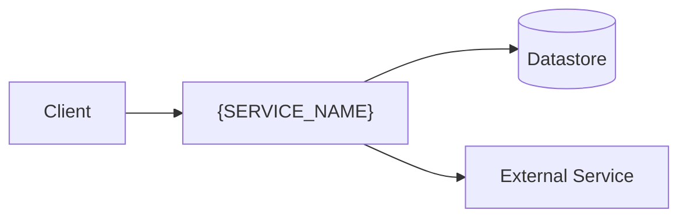

# {SERVICE_NAME}

> {Single-sentence purpose — what business problem this service solves.}

## 1. Service Identity Card

| Field | Value |
|---|---|
| **Service Name** | {Canonical name used across all documentation} |
| **Service ID** | {kebab-case identifier} |
| **Purpose** | {Single sentence} |
| **Domain** | {Bounded context, e.g., Payments, Identity, Notifications} |
| **Keywords & Synonyms** | {Alternative names used by business or other teams} |
| **Owner / Team** | {Team name} |
| **Technology Stack** | {e.g., Java 21 + Spring Boot, Node.js + Express, Python + FastAPI, Go} |
| **Repository** | {Repo URL or name} |

---

## 2. Architecture Overview

{One or two paragraphs describing the system at a high level: what it is, its main components, and how
data moves through it.}



---

## 3. Entry Points (Inputs)

### 3.1 {Entry Point Name}

| Field | Value |
|---|---|
| **Type** | {REST / gRPC / GraphQL / Queue / Topic / Cron / CLI / Event / Webhook} |
| **Identifier** | {`POST /api/v1/orders` / queue name / topic / cron expression} |
| **Contract** | {Link to schema or inline definition} |
| **Trigger Semantics** | {What business event/intent this represents} |
| **Auth** | {Who/what can call it} |

<!-- Repeat for each entry point. Write "None" with a note if there are no inputs of a kind. -->

---

## 4. Exit Points (Outputs)

### 4.1 {Exit Point Name}

| Field | Value |
|---|---|
| **Type** | {DB write / Queue publish / API call / Cache update / File write} |
| **Target** | {Table/collection / queue / topic / external service / cache key pattern} |
| **Schema** | {Link or inline} |
| **Semantics** | {Business meaning} |
| **Conditions** | {Always / On success / On specific state} |

<!-- Repeat for each exit point. -->

---

## 5. Data Flow

{Describe how a request/message flows through the system from entry to exit, referencing the diagram in
section 2. Use a sequence diagram (per references/mermaid-rules.md) for the primary flow if helpful.}

---

## 6. Business Logic

### 6.1 Primary Flows

#### Flow: {Flow Name}

1. {Step 1 — e.g., "Receive order via POST /api/v1/orders" (`OrderController#create`)}
2. {Step 2 — e.g., "Validate user status by calling UserService"}
3. {Step 3 — e.g., "Persist order with status PENDING"}
4. {Step 4 — e.g., "Publish OrderCreated event"}

**Branching Conditions:**
- {Condition → outcome}

**Business Rules:**
- {Rule}

### 6.2 State Transitions

```
{INITIAL_STATE} → {NEXT_STATE}  [trigger: {what causes transition}]
{NEXT_STATE}    → {FINAL_STATE} [trigger: {what causes transition}]
```

### 6.3 Error Handling & Edge Cases

| Error Scenario | Behavior |
|---|---|
| {e.g., dependency unavailable} | {e.g., retries 3x, then returns 503} |

---

## 7. External Services & Dependencies

### 7.1 {Dependency Name}

| Field | Value |
|---|---|
| **Service/Resource** | {Canonical name — must match that service's identity} |
| **Type** | {Sync HTTP / Async message / DB read / Cache lookup} |
| **Purpose** | {WHY it's called} |
| **Data Exchanged** | {What is sent/received} |
| **Criticality** | {Blocking / Non-blocking, Required / Optional} |
| **Failure Behavior** | {Fallback / retry / circuit breaker} |

<!-- Repeat for each dependency. -->

---

## 8. Data Contracts & Domain Models

### 8.1 Key Entities

#### {Entity Name}

| Field | Type | Description |
|---|---|---|
| {field_name} | {type} | {business meaning} |

**Data Ownership:** {This service is / is not the source of truth for this entity.}

### 8.2 Ubiquitous Language

| Term | Meaning in This Service |
|---|---|
| {Term} | {Specific meaning within this bounded context} |

---

## 9. Integration & Dependency Map

```
Upstream (who calls this service):
  - {ServiceA} — {via REST / via queue}

Downstream (who this service calls):
  - {ServiceC} — {purpose}

Shared Infrastructure:
  - {orders-db} — {datastore type}
  - {orders-events-topic} — {messaging type}

Events Consumed:  [{EventName} from {source}]
Events Published: [{EventName} to {target}]
```

---

## 10. Configuration

Document the configuration chain by **key/path → application property**. Never include secret values.

| Config Value | Source (env config / parameter-store path) | Env Var | Application Property |
|---|---|---|---|
| {e.g., DB URL} | {env-specific config / store path} | {DATABASE_URL} | {datasource.url} |

{Note which environments differ and how.}

---

## 11. Project Structure & How to Run / Operate

### 11.1 Repository Layout

```
{Annotated directory tree of the project}
```

### 11.2 Build & Run

| Aspect | Details |
|---|---|
| **Build Tool** | {npm / Maven / Gradle / Cargo / Go / ...} |
| **Build Command** | {e.g., `mvn clean package` / `npm run build`} |
| **Test Command** | {e.g., `mvn test` / `npm test`} |
| **Run Command** | {e.g., `npm start` / `java -jar ...` / `docker compose up`} |
| **Container** | {Dockerfile location, base image if notable} |
| **CI / Pipeline** | {Provider + pipeline file} |
| **Environments** | {dev / staging / production — and how config differs} |

---

## 12. Searchability Anchors

| Anchor Type | Values |
|---|---|
| **Feature Flags** | {flag names referenced in code} |
| **Functional Areas** | {tags: #billing, #onboarding, ...} |
| **User-Facing Features** | {business names from PRDs/user stories} |
| **Key Code Locations** | {class/module → purpose} |

---

## 13. Additional Notes

{Known tech debt, planned migrations, historical context, links to diagrams/runbooks/related docs.}
