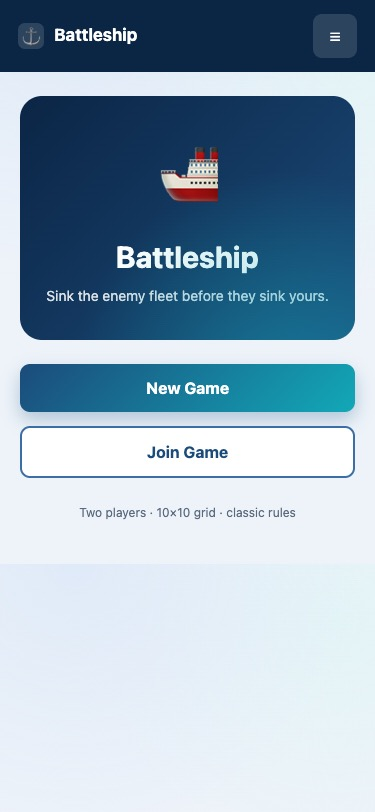
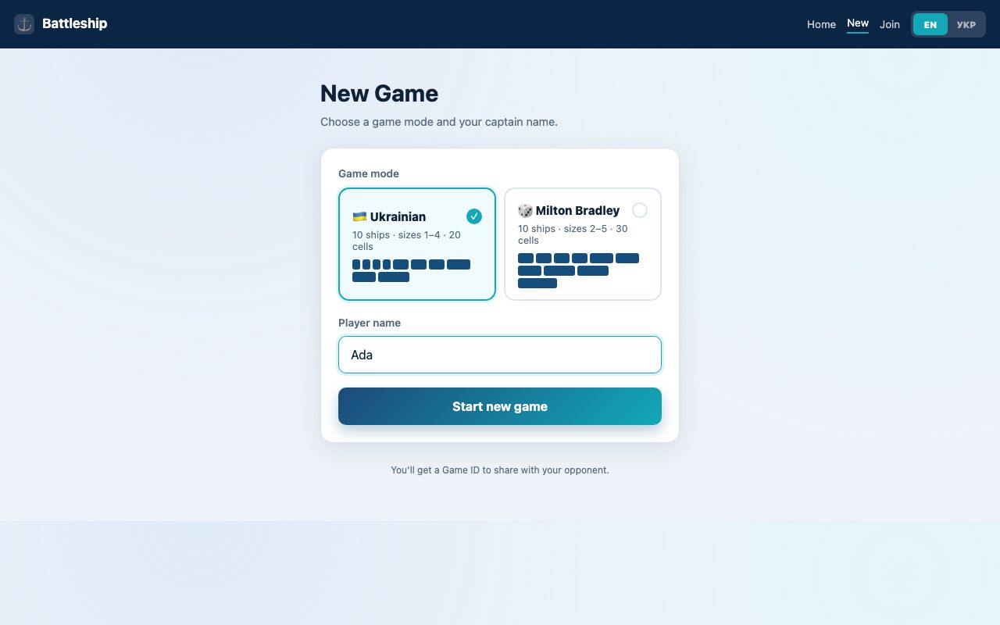
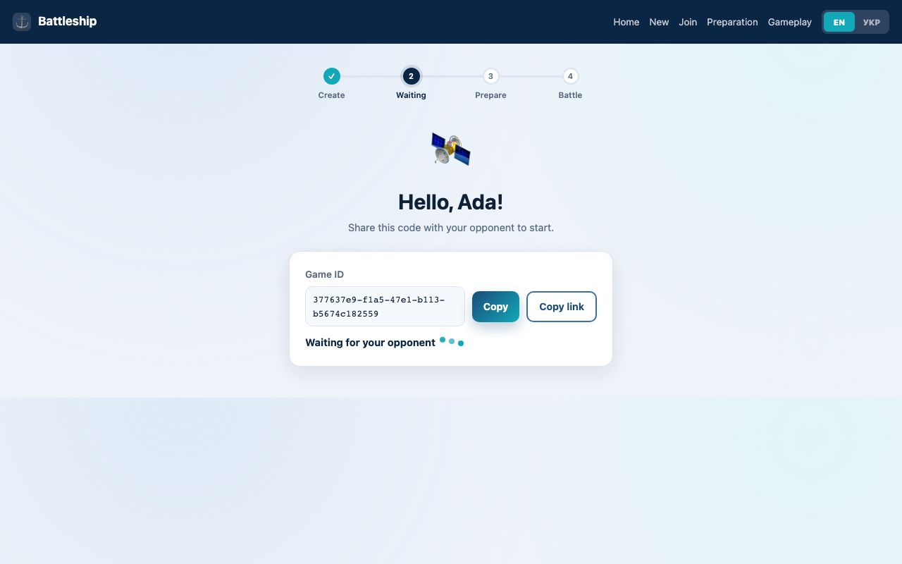
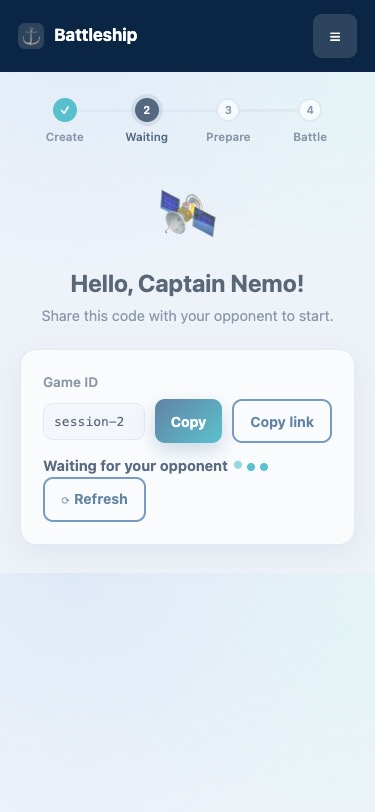
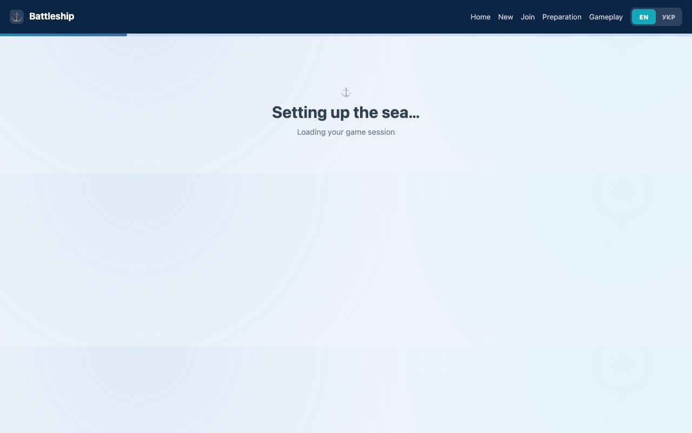
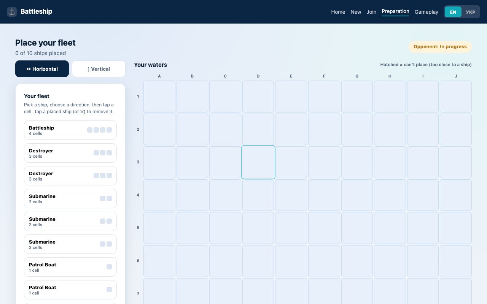
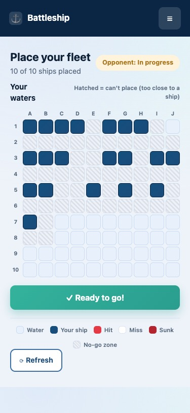
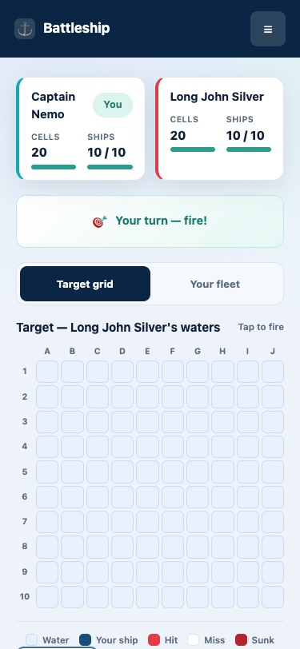
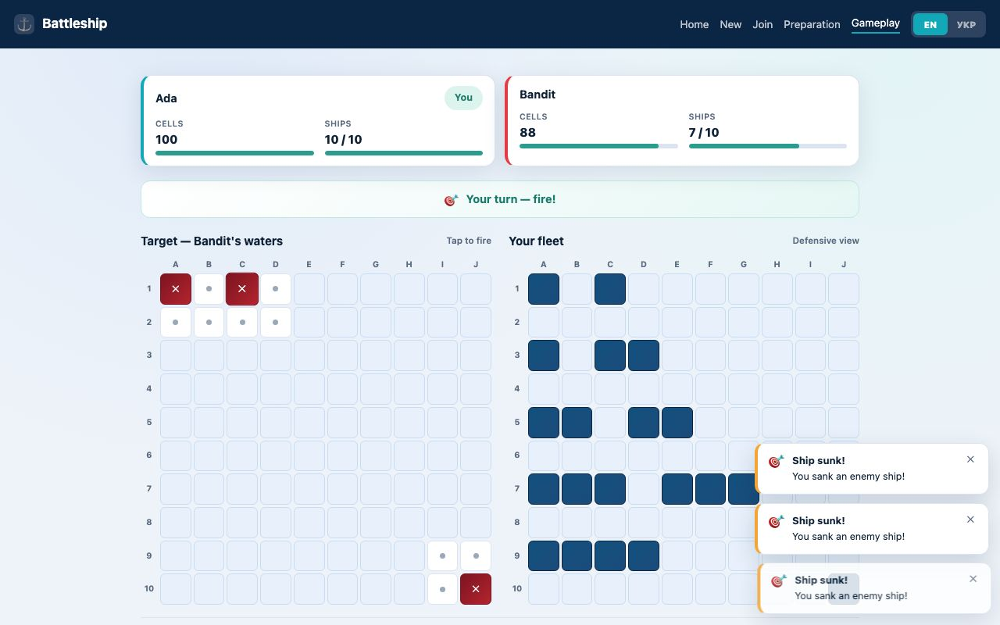
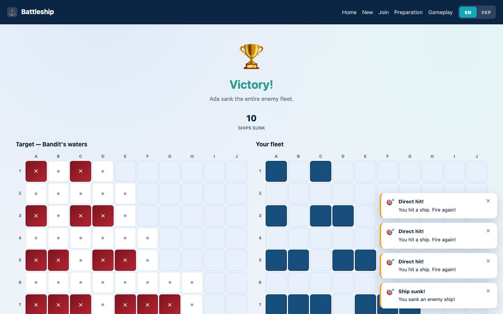

# battleship_java

A Battleship game: a Java + Spring Boot REST/MVC backend and a React + TypeScript frontend,
bundled together into a single runnable JAR. A rewrite of a prior
[Python version](https://github.com/sanyokkua/battleship_py) with a redesigned UI approach.

## Screenshots












## Stack

**Backend** (`src/`): Java 25, Spring Boot 4.1.0 (Web/MVC), Maven, springdoc-openapi (Swagger UI
and OpenAPI spec generation). Tests use JUnit 5, Mockito, AssertJ, and MockMvc.

**Frontend** (`frontend/`): React 19, TypeScript, Vite, i18next (English/Ukrainian). Tests use
Vitest and Playwright.

The Maven build compiles the frontend into the backend's JAR — see
[Build & run](#build--run) below.

## API

The backend exposes 13 REST endpoints across 4 controllers (session/common, preparation,
gameplay, and a server-sent-events stream for session/player push updates) under
`/api/v2/game`. With the app running, the full interactive API description is at
[localhost:8080/swagger-ui.html](http://localhost:8080/swagger-ui.html). For the complete
endpoint table (verbs, paths, request/response DTOs, trigger semantics), see
[docs/index.md §3 Entry Points](docs/index.md#3-entry-points-inputs). The generated OpenAPI 3
spec is committed at [`docs/openapi.json`](docs/openapi.json).

## Build & run

### Prerequisites

- JDK 25
- Maven 3.9+
- Node.js is **not** required to run a full Maven build — `frontend-maven-plugin` installs its
  own pinned Node (`v24.18.0`, configured in `pom.xml`; `frontend/package.json` declares no
  `engines` field) automatically during `mvn` builds. Install Node yourself only if you want to
  run the frontend dev server or its test suites directly via `npm`.

### Full build + run

Builds the frontend (Vite) and backend together into one JAR, then starts it:

```shell
mvn clean install && mvn spring-boot:run
```

The app serves at **[localhost:8080](http://localhost:8080)**.

### Build only

```shell
mvn clean install
```

Also regenerates `docs/openapi.json` (bound to the `integration-test` phase via
`springdoc-openapi-maven-plugin`, so it runs as part of `install`/`verify`/`deploy`, not plain
`mvn package`).

### Backend tests

```shell
mvn test                              # all tests
mvn test -Dtest=ClassName             # a single test class
mvn test -Dtest=ClassName#methodName  # a single test method
```

### Frontend dev loop

From `frontend/`:

```shell
npm install
npm run dev        # Vite dev server against a running backend
npm run dev:mock   # Vite dev server against the in-browser MockGameAdapter, no backend needed
npm run build       # production build (tsc && vite build)
npm run preview      # preview the production build
```

### Frontend tests

From `frontend/`:

```shell
npm run test           # Vitest unit/component tests
npm run test:coverage  # Vitest with coverage report
npm run test:e2e       # Playwright e2e tests
npm run test:e2e:live  # Playwright e2e against a live running server
npm run lint            # ESLint
```

### Docker

```shell
docker build -t battleship . && docker run -p 8080:8080 battleship
```

### Docker Compose

```shell
docker compose up
```

### Podman

The `Dockerfile` isn't written in Containerfile-specific syntax, so Podman needs `--format
docker`:

```shell
podman build --format docker -t battleship . && podman run -p 8080:8080 battleship
```

### Podman Compose

```shell
podman compose up
```

### Running without a container

Use the full build + run commands above (`mvn clean install && mvn spring-boot:run`) — no
container runtime is required at all; Docker/Podman are alternative deployment paths, not a
prerequisite.

## Documentation

- **[docs/index.md](docs/index.md)** — architecture, REST API, business logic (game engine rules,
  state machine), data contracts, configuration, and how to run.
- **[docs/architecture.md](docs/architecture.md)** — the `GameStage` state diagram, two sequence
  diagrams (session setup, gameplay loop), and a game-edition comparison.
- **[docs/openapi.json](docs/openapi.json)** — the generated OpenAPI 3 spec.
- **[LICENSE](LICENSE)** — GNU GPLv3.

## Known gaps

No CI pipeline (by design — this project isn't meant to be deployed), no CORS configuration, and
persistence is in-memory and single-instance only (state doesn't survive a restart, and isn't
shared across instances). See [docs/index.md §13 Additional Notes](docs/index.md#13-additional-notes)
for the full, verified list.
