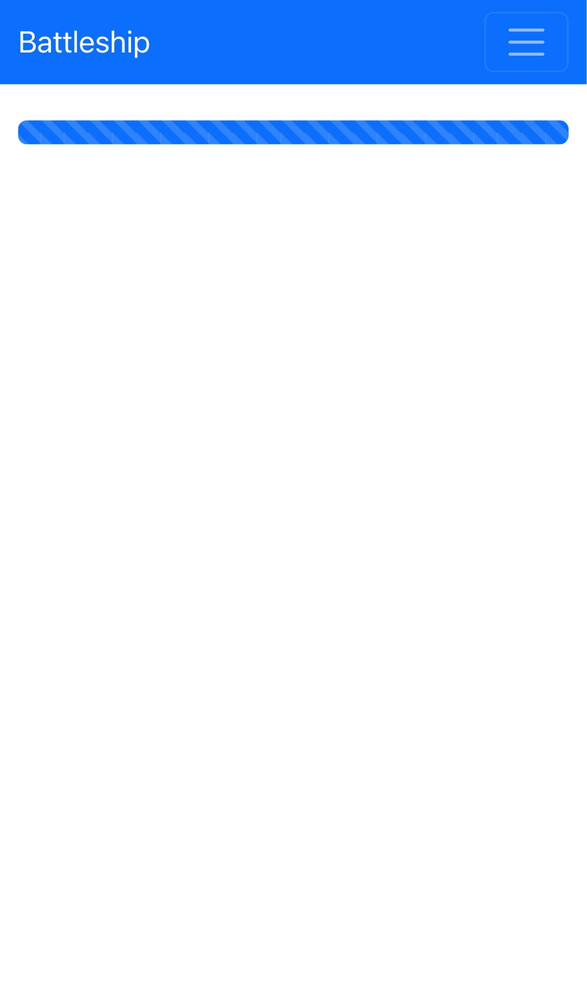

# battleship_java

**Battleship** game implementation on Java and React (for education purposes).

This project is developed on Java+Spring Boot (Rest/MVC) to provide REST API and in addition to REST API will
be developed UI using ReactJS (Typescript).
It is a rewriting of the [Python version](https://github.com/sanyokkua/battleship_py) with a complete redesign of the
UI approach.

PS: I am not expert in the building UI apps and this project should not be used as reference for any production
projects.

## How it looks like





## Technical Stack and information:

The project consists of two components - UI and Backend projects. UI project is placed in the ***frontend*** folder and
represents the Typescript React Js project.
In the ***src*** folder can be found backend code written using Java + Spring Boot.

In order to build deployable JAR file were used maven plugins to copy UI resources from fronted project to the build of
the java project.

API endpoints created for UI:

By [this link](http://localhost:8080/swagger-ui/index.html) on the running spring-boot app can be found Swagger-UI with
the description of the API.

Below - you can find a short description of the endpoints.

### game-session-common-rest-controller:

- **POST** - /api/v2/game/sessions
- **POST** - /api/v2/game/sessions/{sessionId}/players
- **GET** - /api/v2/game/sessions/{sessionId}/state
- **GET** - /api/v2/game/sessions/{sessionId}/changesTime
- **GET** - /api/v2/game/editions

### preparation-rest-controller:

- **PUT** - /api/v2/game/sessions/{sessionId}/players/{playerId}/ships/{shipId}
- **POST** - /api/v2/game/sessions/{sessionId}/players/{playerId}/start
- **GET** - /api/v2/game/sessions/{sessionId}/players/{playerId}/preparationState
- **GET** - /api/v2/game/sessions/{sessionId}/players/{playerId}/opponent
- **DELETE** - /api/v2/game/sessions/{sessionId}/players/{playerId}/ships

### game-session-common-rest-controller:

- **POST** - /api/v2/game/sessions
- **POST** - /api/v2/game/sessions/{sessionId}/players
- **GET** - /api/v2/game/sessions/{sessionId}/state
- **GET** - /api/v2/game/sessions/{sessionId}/changesTime
- **GET** - /api/v2/game/editions

## Hot to build and start

You need pre-install Java and Maven to build the Spring boot project and run it.

If you want to start a separate frontend project - Node JS is also required.

Configuration of the system where the application was developed and tested:

- **OS**: Mac OS Monterey 12.6.1 (Intel)
- **Java**:
  openjdk version "17.0.4.1" 2022-08-12
  OpenJDK Runtime Environment Temurin-17.0.4.1+1 (build 17.0.4.1+1)
  OpenJDK 64-Bit Server VM Temurin-17.0.4.1+1 (build 17.0.4.1+1, mixed mode, sharing)
- **Maven**:
  Apache Maven 3.8.6
  Java version: 17.0.4.1, vendor: Eclipse Adoptium, runtime:
  /Library/Java/JavaVirtualMachines/temurin-17.jdk/Contents/Home
  OS name: "mac os x", version: "12.6.1", arch: "x86_64", family: "mac"
- **NodeJS**: v16.17.0
- **Npm**: 8.19.2

To build and start just run the following command and you will have the up-and-running app
on **[localhost:8080](localhost:8080)**

```shell
mvn clean install && mvn spring-boot:run
```

## TODO:

- Add JavaDocs
- Review test cases
