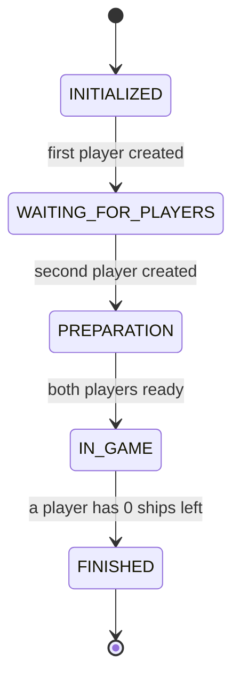
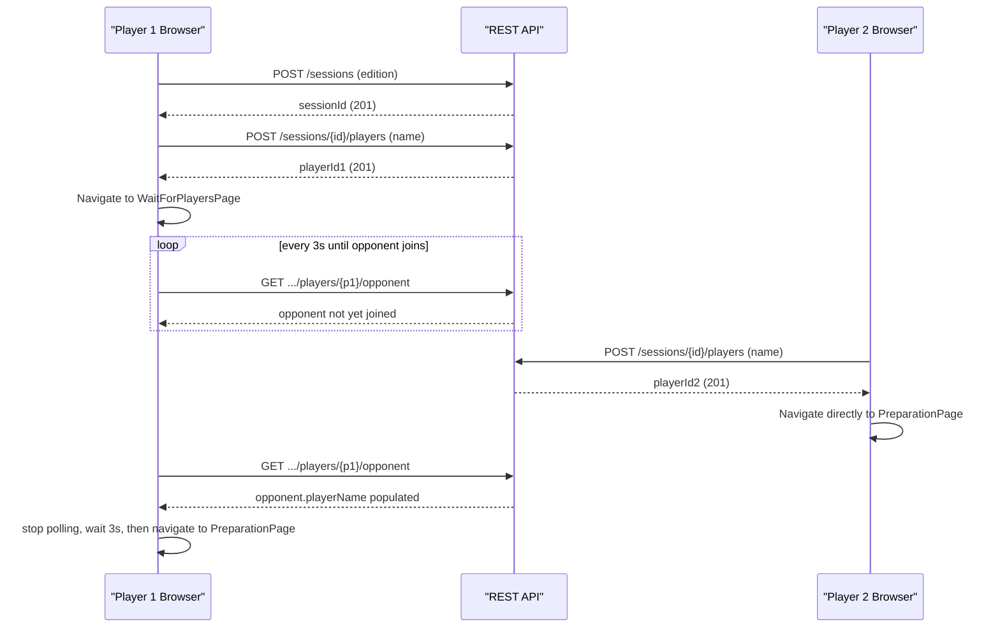
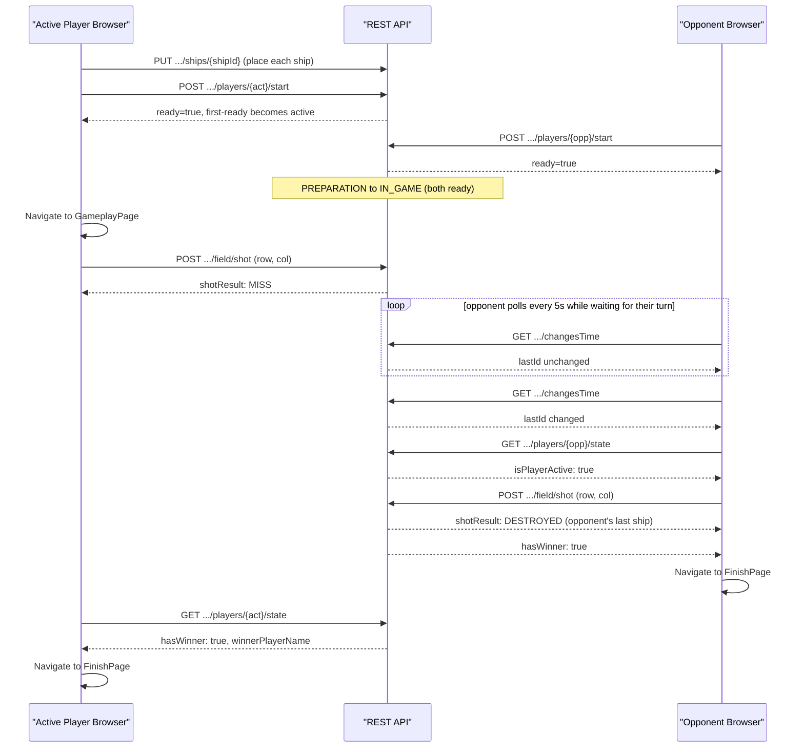

# Architecture — battleship_java

This expands on [`docs/index.md` §2](index.md#2-architecture-overview) with the `GameStage` state
machine and two call-by-call sequence flows. It documents the **current** (pre-redesign) system on
branch `feature/redesign-v2`; the in-progress v2 plan lives separately in
[`docs/redesign/README.md`](redesign/README.md) and is not summarized here.

## Layered backend

The backend is a strict top-down layering with no back-references:

- **`web.controllers.rest`** — three `@RestController`s (`GameSessionCommonRestController`,
  `PreparationRestController`, `GameplayRestController`), all under `/api/v2/game`. Controllers do
  request/response DTO mapping only; they hold no business logic.
- **`logic.api`** — `GameControllerApi` / `GameControllerApiImpl` is the single boundary between
  web and engine. `ValidationUtils` performs all input validation here (blank checks, enum
  parsing, coordinate bounds), throwing one of 8 typed exceptions on failure. No Spring MVC type
  (`ResponseEntity`, `@RequestParam`, etc.) appears below this layer.
  `IdGenerator`/`IdGeneratorImpl` mints UUIDv4 session/player/ship IDs.
- **`logic.engine`** — `Game`/`GameImpl` owns the `GameStage` state machine and player
  orchestration; `FieldManagement`/`FieldManagementImpl` owns per-player board state (ship
  placement, shot resolution). Both are framework-agnostic — no Spring annotations. Ruleset
  differences are injected via `GameEditionConfiguration` (`UkrainianGameEditionConfiguration` /
  `MiltonBradleyGameEditionConfiguration`).
- **`logic.persistence`** — `Persistence`/`InMemoryPersistence` is the sole storage: a
  `HashMap<String sessionId, GameState>` with no database, no synchronization, and no eviction.
  Every mutating engine call is followed by a full `save()` of the resulting `GameState`.

## Current frontend structure

`frontend/src/` is a class-component CRA app (no hooks-based rewrite yet — that is v2 scope):

- **`ui/pages/`** — one component per route (7 pages, see the routing table in
  [`docs/index.md` §11.1](index.md#111-repository-layout)). Pages own all `setInterval` polling and
  navigation (`<Navigate>`).
- **`ui/elements/`** — presentational grids/forms (`PrepareField`, `GameplayField`, `ShipsList`,
  `NewGameForm`, `JoinGameForm`, etc.), receiving data and callbacks from their parent page.
- **`services/BackendRequestService.ts`** — the *only* place axios is used; 12 methods, one per
  backend endpoint, with `axios-retry` configured for 3 automatic retries.
- **`services/GameBrowserStorage.ts`** — 3 `localStorage` keys (`player_obj`, `session_str`,
  `gameStage_str`), read once on app mount to restore an in-progress game after a page reload; none
  are ever explicitly cleared.
- **`utils/GameUtils.ts`** / **`utils/StringUtils.ts`** — thin async wrappers and form validation
  (`isValidString`: length > 2).

---

## Diagram 1 — `GameStage` state machine

Five states, four transitions. (Ship-removal resetting a player's `ready` flag does **not** change
`GameStage` — see the note in [`docs/index.md` §6.2](index.md#62-state-transitions) — so it is
omitted from this diagram to keep it a pure stage-transition view.)

---

## Diagram 2 — Session setup (creation through entering PREPARATION)

Covers `HomePage` → `NewGamePage`/`JoinGamePage` → session/player creation →
`WaitForPlayersPage` polling → both browsers landing in `PREPARATION`.

Note the asymmetry: player 1 waits on `WaitForPlayersPage` and polls every 3 seconds; player 2
(the joiner) skips straight to `PreparationPage` since by definition the session already has both
players once they join.

---

## Diagram 3 — Gameplay loop (ship placement/ready through a finished game)

Covers `PreparationPage` ship placement/ready, the transition into `GameplayPage`, a shot and its
result, the 5-second `changesTime` poll, and the transition to `FinishPage` on a winner.

`GameplayPage`'s poll is suspended whenever the local player scores a `HIT`/`DESTROYED` (they keep
shooting immediately, no poll needed) and resumes on a `MISS` or once it becomes the opponent's
turn — see `frontend/src/ui/pages/GameplayPage.tsx`.

---

## Game edition comparison

Both editions use a 10×10 board and exactly 10 ships; only the ship-size distribution (and
therefore total occupied cells) differs.

| Ship Type | Size | Ukrainian — Count | Milton Bradley — Count |
|---|---|---|---|
| PATROL_BOAT | 1 | 4 | — |
| SUBMARINE | 2 | 3 | 4 |
| DESTROYER | 3 | 2 | 3 |
| BATTLESHIP | 4 | 1 | 2 |
| CARRIER | 5 | — | 1 |
| **Total ships** | | **10** | **10** |
| **Total occupied cells** | | **20** | **30** |

Source: `logic/engine/config/UkrainianGameEditionConfiguration.java` and
`MiltonBradleyGameEditionConfiguration.java`.
