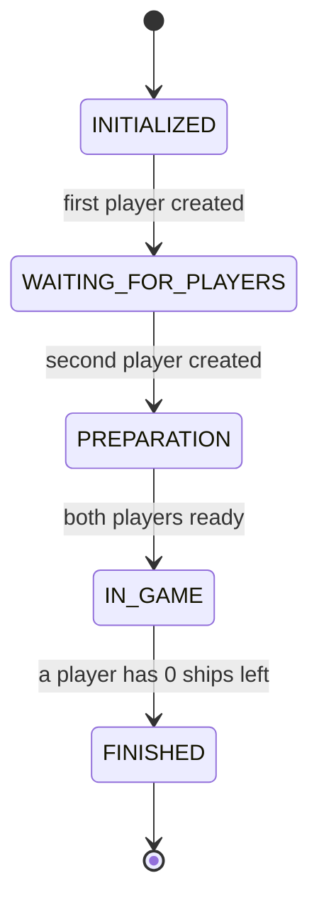
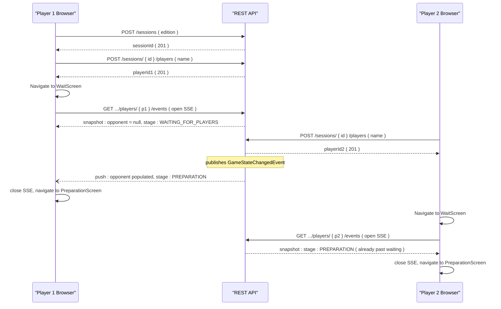
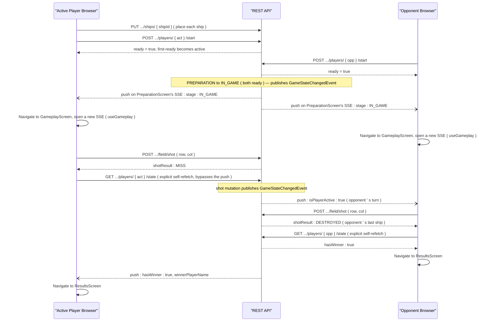

# Architecture — battleship_java

This expands on [`docs/index.md` §2](index.md#2-architecture-overview) with the `GameStage` state
machine and two call-by-call sequence flows. It documents the **current, shipped** system on
branch `feature/redesign-v2`. The backend layering and the game engine's state machine are
unchanged from the pre-redesign system, so §"Layered backend" and Diagram 1 below reflect that
continuity; the frontend structure and the two sequence diagrams match the shipped Vite/React 19
frontend (verified against `frontend/src/hooks/` and `frontend/src/screens/`). See
[`docs/openapi.json`](openapi.json) for the authoritative REST API contract.

## Layered backend

The backend is a strict top-down layering with no back-references:

- **`web.controllers.rest`** — four `@RestController`s (`GameSessionCommonRestController`,
  `PreparationRestController`, `GameplayRestController`, `GameSessionEventsRestController`), all
  under `/api/v2/game`. Controllers do request/response DTO mapping only; they hold no business
  logic. `GameSessionEventsRestController` is the exception to "request/response" — it returns a
  long-lived `SseEmitter` (see `web.sse` below) rather than a single response.
- **`web.sse`** — `SessionEventBroadcaster` holds per-`(sessionId, playerId)` `SseEmitter`
  subscriptions and pushes a fresh `ResponseSessionPushDto` snapshot to them whenever a
  `GameStateChangedEvent` is published. Every mutating `GameControllerApiImpl` method (session
  creation, player join, ship placement/removal, marking ready, taking a shot) publishes this
  event after releasing its per-session lock, so broadcasting can never stall an unrelated request
  against the same session. Payloads are built per-subscriber (not broadcast identically), since an
  opponent's ships stay hidden until the game finishes.
- **`logic.api`** — `GameControllerApi` / `GameControllerApiImpl` is the single boundary between
  web and engine. `ValidationUtils` performs all input validation here (blank checks, enum
  parsing, coordinate bounds), throwing one of 8 typed exceptions on failure. No Spring MVC type
  (`ResponseEntity`, `@RequestParam`, etc.) appears below this layer.
  `IdGenerator`/`IdGeneratorImpl` mints UUIDv4 session/player/ship IDs.
- **`logic.engine`** — `Game`/`GameImpl` owns the `GameStage` state machine and player
  orchestration; `FieldManagement`/`FieldManagementImpl` owns per-player board state (ship
  placement, shot resolution). Both are framework-agnostic — no Spring annotations. Ruleset
  differences are injected via `GameEditionConfiguration` (`UkrainianGameEditionConfiguration` /
  `MiltonBradleyGameEditionConfiguration`).
- **`logic.persistence`** — `Persistence`/`InMemoryPersistence` is the sole storage: a
  `ConcurrentHashMap<String sessionId, GameState>` with no database and no eviction. Every
  mutating engine call is followed by a full `save()` of the resulting `GameState`; `GameControllerApiImpl`
  wraps each such load → mutate → save sequence in a lock scoped to that `sessionId`, so
  concurrent requests against the same session are serialized without unrelated sessions blocking
  each other.

## Current frontend structure

`frontend/src/` is a Vite + React 19 + TypeScript app built entirely with function components and
hooks, following an Adapter/Widget architecture (see the tree in
[`docs/index.md` §11.1](index.md#111-repository-layout)):

- **`adapters/`** — the `GameAdapter` port (interface) plus two implementations:
  `HttpGameAdapter` (wraps the real backend calls, one method per endpoint, delegating the actual
  axios requests to `services/BackendRequestService.ts` with `axios-retry` configured for automatic
  retries) and `MockGameAdapter` (in-memory fake used by `npm run dev:mock` and by tests). No widget
  or screen calls the network directly — every backend interaction goes through this port.
- **`screens/`** — one component per route (7 screens: `HomeScreen`, `NewGameScreen`,
  `JoinGameScreen`, `WaitScreen`, `PreparationScreen`, `GameplayScreen`, `ResultsScreen`), composed
  from `widgets/` and driven by the `hooks/` below. Routing and stage-based redirects live in
  `routing/AppRoutes.tsx` and `routing/StageGuard.tsx`.
- **`hooks/`** — one push/state hook per screen that needs it, each built on the shared
  `useSessionEvents` SSE-subscription hook: `usePreparation` (also does a one-time fetch of the
  current player's ships/field on mount; opponent-ready/stage come from the push), `useWaitRoom`
  (stops applying pushes once the session stage moves past `WAITING_FOR_PLAYERS`), `useGameplay`
  (stops applying pushes once the gameplay state reports a winner; the acting player's own shot
  outcome bypasses the push via an explicit refetch — see Diagram 3), `useSessionGuard`
  (reads/validates the locally stored session/player).
- **`widgets/`** — reusable feature UI grouped by area: `board/` (the 10×10 grid + legend),
  `preparation/` (ship tray, direction toggle, ship-action/placement popups), `gameplay/` (player
  card, turn banner), `feedback/` (toasts, confirm dialogs, backend-error-to-i18n-key mapping),
  `layout/` (app bar, loading view).
- **`design/`** — the custom CSS design system that replaced Bootstrap: design tokens
  (`tokens.css`, `base.css`) and a small component set (`Button`, `Field`, `Input`, `LoadingBar`,
  `ModeCard`, `Pill`, `Sheet`, `StepTracker`).
- **`i18n/`** / **`i18n-support/`** — i18next configuration and `en`/`uk` locale JSON (`common`,
  `errors`, `notifications`, `screens` namespaces), plus lookup helpers for edition/ship-type
  display names.
- **`services/GameBrowserStorage.ts`** — `localStorage` persistence for the in-progress
  session/player, read on app mount (via `useSessionGuard`) to restore state after a page reload.

---

## Diagram 1 — `GameStage` state machine

Five states, four transitions. (Ship-removal resetting a player's `ready` flag does **not** change
`GameStage` — see the note in [`docs/index.md` §6.2](index.md#62-state-transitions) — so it is
omitted from this diagram to keep it a pure stage-transition view.)

---

## Diagram 2 — Session setup (creation through entering PREPARATION)

Covers `HomeScreen` → `NewGameScreen`/`JoinGameScreen` → session/player creation →
`WaitScreen`'s SSE subscription (`useWaitRoom`) → both browsers landing in `PreparationScreen`.

Both players route through `WaitScreen`/`useWaitRoom`, which opens a single SSE subscription
(`useSessionEvents`) instead of polling: `GameSessionEventsRestController` sends an immediate
state snapshot on connect, then a fresh push whenever another mutating call (here, player 2
joining) publishes a `GameStateChangedEvent` for that session. `useWaitRoom` stops applying
further pushes once a received snapshot's stage reaches `PREPARATION` or later, and the
subscription itself closes on unmount (navigation away from `WaitScreen`). This produces the same
asymmetry as before: player 1 (the creator) genuinely waits for a push once player 2 joins, while
player 2 (the joiner) sees `PREPARATION` on its very first, immediate snapshot — since by
definition the session already has both players once they join — and passes through `WaitScreen`
almost instantly rather than waiting on a push at all.

---

## Diagram 3 — Gameplay loop (ship placement/ready through a finished game)

Covers `PreparationScreen` ship placement/ready (`usePreparation`), the transition into
`GameplayScreen`, a shot and its result, the SSE-pushed gameplay state (`useGameplay`), and the
transition to `ResultsScreen` on a winner.

`useGameplay` opens a single SSE subscription (`useSessionEvents`) on mount instead of polling, and
applies each pushed `gameplayState` directly. The *acting* player's own view bypasses the push
entirely: `shoot()` calls the adapter immediately and refetches state right after via a plain
`GET .../state` call, so the UI reflects the shot's outcome without waiting for a round trip
through the push channel — the push exists to observe the *opponent's* moves. Once a pushed or
refetched state reports `hasWinner`, a `doneRef` flag stops applying any further pushes, so a stray
late event can't resurrect a stale non-winning state — see `frontend/src/hooks/useGameplay.ts` and
`frontend/src/screens/GameplayScreen.tsx`.

---

## Game edition comparison

Both editions use a 10×10 board and exactly 10 ships; only the ship-size distribution (and
therefore total occupied cells) differs.

| Ship Type                | Size | Ukrainian — Count | Milton Bradley — Count |
|--------------------------|------|-------------------|------------------------|
| PATROL_BOAT              | 1    | 4                 | —                      |
| SUBMARINE                | 2    | 3                 | 4                      |
| DESTROYER                | 3    | 2                 | 3                      |
| BATTLESHIP               | 4    | 1                 | 2                      |
| CARRIER                  | 5    | —                 | 1                      |
| **Total ships**          |      | **10**            | **10**                 |
| **Total occupied cells** |      | **20**            | **30**                 |

Source: `logic/engine/config/UkrainianGameEditionConfiguration.java` and
`MiltonBradleyGameEditionConfiguration.java`.
