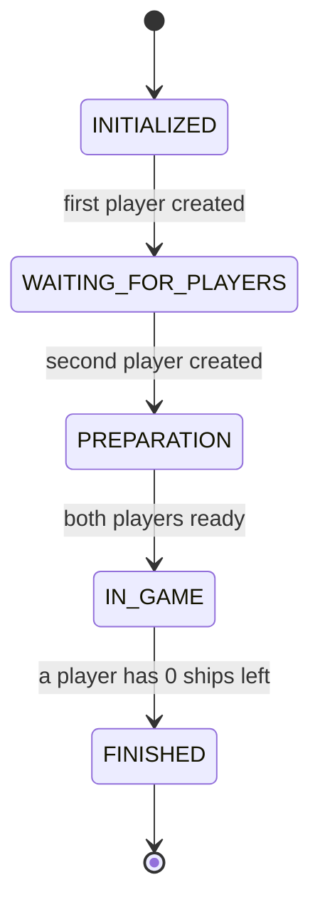
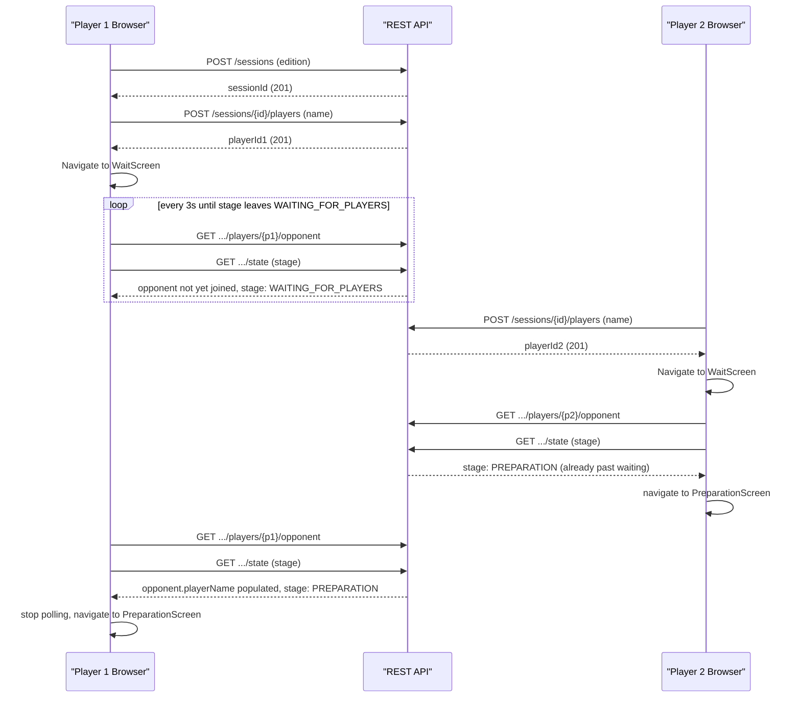
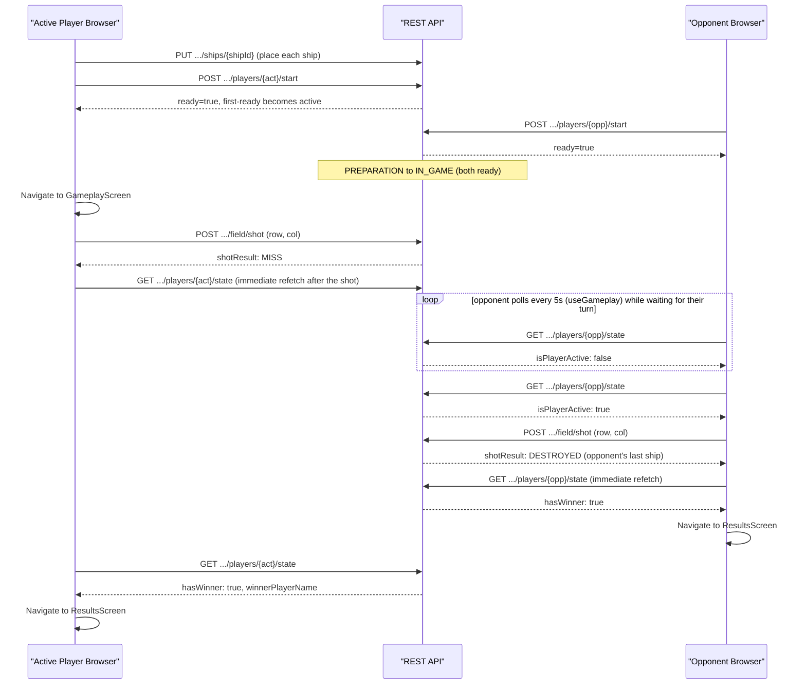

# Architecture — battleship_java

This expands on [`docs/index.md` §2](index.md#2-architecture-overview) with the `GameStage` state
machine and two call-by-call sequence flows. It documents the **current, shipped** system on
branch `feature/redesign-v2`. The backend layering and the game engine's state machine are
unchanged from the pre-redesign system, so §"Layered backend" and Diagram 1 below reflect that
continuity; the frontend structure and the two sequence diagrams match the shipped Vite/React 19
frontend (verified against `frontend/src/hooks/` and `frontend/src/screens/`). See
[`docs/openapi.json`](openapi.json) for the authoritative REST API contract.

## Layered backend

The backend is a strict top-down layering with no back-references:

- **`web.controllers.rest`** — three `@RestController`s (`GameSessionCommonRestController`,
  `PreparationRestController`, `GameplayRestController`), all under `/api/v2/game`. Controllers do
  request/response DTO mapping only; they hold no business logic.
- **`logic.api`** — `GameControllerApi` / `GameControllerApiImpl` is the single boundary between
  web and engine. `ValidationUtils` performs all input validation here (blank checks, enum
  parsing, coordinate bounds), throwing one of 8 typed exceptions on failure. No Spring MVC type
  (`ResponseEntity`, `@RequestParam`, etc.) appears below this layer.
  `IdGenerator`/`IdGeneratorImpl` mints UUIDv4 session/player/ship IDs.
- **`logic.engine`** — `Game`/`GameImpl` owns the `GameStage` state machine and player
  orchestration; `FieldManagement`/`FieldManagementImpl` owns per-player board state (ship
  placement, shot resolution). Both are framework-agnostic — no Spring annotations. Ruleset
  differences are injected via `GameEditionConfiguration` (`UkrainianGameEditionConfiguration` /
  `MiltonBradleyGameEditionConfiguration`).
- **`logic.persistence`** — `Persistence`/`InMemoryPersistence` is the sole storage: a
  `HashMap<String sessionId, GameState>` with no database, no synchronization, and no eviction.
  Every mutating engine call is followed by a full `save()` of the resulting `GameState`.

## Current frontend structure

`frontend/src/` is a Vite + React 19 + TypeScript app built entirely with function components and
hooks, following an Adapter/Widget architecture (see the tree in
[`docs/index.md` §11.1](index.md#111-repository-layout)):

- **`adapters/`** — the `GameAdapter` port (interface) plus two implementations:
  `HttpGameAdapter` (wraps the real backend calls, one method per endpoint, delegating the actual
  axios requests to `services/BackendRequestService.ts` with `axios-retry` configured for automatic
  retries) and `MockGameAdapter` (in-memory fake used by `npm run dev:mock` and by tests). No widget
  or screen calls the network directly — every backend interaction goes through this port.
- **`screens/`** — one component per route (7 screens: `HomeScreen`, `NewGameScreen`,
  `JoinGameScreen`, `WaitScreen`, `PreparationScreen`, `GameplayScreen`, `ResultsScreen`), composed
  from `widgets/` and driven by the `hooks/` below. Routing and stage-based redirects live in
  `routing/AppRoutes.tsx` and `routing/StageGuard.tsx`.
- **`hooks/`** — one polling/state hook per screen that needs it: `usePreparation` (3s poll),
  `useWaitRoom` (3s poll, stops once the session stage moves past `WAITING_FOR_PLAYERS`),
  `useGameplay` (5s poll, stops once the gameplay state reports a winner), `useSessionGuard`
  (reads/validates the locally stored session/player). All are built on the shared `usePolling`
  interval hook.
- **`widgets/`** — reusable feature UI grouped by area: `board/` (the 10×10 grid + legend),
  `preparation/` (ship tray, direction toggle), `gameplay/` (player card, turn banner), `feedback/`
  (toasts, confirm dialogs, backend-error-to-i18n-key mapping), `layout/` (app bar, loading view).
- **`design/`** — the custom CSS design system that replaced Bootstrap: design tokens
  (`tokens.css`, `base.css`) and a small component set (`Button`, `Card`, `Field`, `Input`,
  `LoadingBar`, `ModeCard`, `Pill`, `StepTracker`).
- **`i18n/`** / **`i18n-support/`** — i18next configuration and `en`/`uk` locale JSON (`common`,
  `errors`, `notifications`, `screens` namespaces), plus lookup helpers for edition/ship-type
  display names.
- **`services/GameBrowserStorage.ts`** — `localStorage` persistence for the in-progress
  session/player, read on app mount (via `useSessionGuard`) to restore state after a page reload.

---

## Diagram 1 — `GameStage` state machine

Five states, four transitions. (Ship-removal resetting a player's `ready` flag does **not** change
`GameStage` — see the note in [`docs/index.md` §6.2](index.md#62-state-transitions) — so it is
omitted from this diagram to keep it a pure stage-transition view.)

---

## Diagram 2 — Session setup (creation through entering PREPARATION)

Covers `HomeScreen` → `NewGameScreen`/`JoinGameScreen` → session/player creation →
`WaitScreen` polling (`useWaitRoom`) → both browsers landing in `PreparationScreen`.

Both players route through `WaitScreen`/`useWaitRoom`, which polls the opponent-info and stage
endpoints together every 3 seconds (immediately on mount, then every 3s) and stops as soon as the
stage is `PREPARATION` or later. In practice this still produces the same asymmetry as before:
player 1 (the creator) genuinely waits through one or more 3-second polls, while player 2 (the
joiner) sees `PREPARATION` on its very first, immediate poll — since by definition the session
already has both players once they join — and passes through `WaitScreen` almost instantly rather
than rendering it for a full interval.

---

## Diagram 3 — Gameplay loop (ship placement/ready through a finished game)

Covers `PreparationScreen` ship placement/ready (`usePreparation`), the transition into
`GameplayScreen`, a shot and its result, the 5-second gameplay-state poll (`useGameplay`), and the
transition to `ResultsScreen` on a winner.

`useGameplay` polls the full `GET .../players/{playerId}/state` endpoint every 5 seconds
unconditionally (there is no separate cheap `changesTime` pre-check in the current frontend — it
polls the same state endpoint the whole time) and stops only once that state reports a winner. It
does not specially suspend polling on a `HIT`/`DESTROYED`; instead, every `shoot()` call
synchronously refetches state right after the shot resolves, which is what makes chained shots on a
`HIT` feel instant regardless of the 5-second interval — see `frontend/src/hooks/useGameplay.ts`
and `frontend/src/screens/GameplayScreen.tsx`.

---

## Game edition comparison

Both editions use a 10×10 board and exactly 10 ships; only the ship-size distribution (and
therefore total occupied cells) differs.

| Ship Type | Size | Ukrainian — Count | Milton Bradley — Count |
|---|---|---|---|
| PATROL_BOAT | 1 | 4 | — |
| SUBMARINE | 2 | 3 | 4 |
| DESTROYER | 3 | 2 | 3 |
| BATTLESHIP | 4 | 1 | 2 |
| CARRIER | 5 | — | 1 |
| **Total ships** | | **10** | **10** |
| **Total occupied cells** | | **20** | **30** |

Source: `logic/engine/config/UkrainianGameEditionConfiguration.java` and
`MiltonBradleyGameEditionConfiguration.java`.
