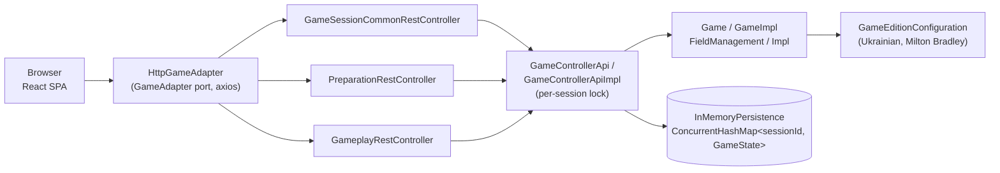

# battleship_java

> An educational two-player Battleship game: a Java/Spring Boot REST API driving a game engine,
> served together with a React/TypeScript single-page frontend in one runnable JAR.

This document describes the **current, as-built system** on branch `feature/redesign-v2` — the
shipped result of the v2 modernization (Java 25 + Spring Boot 4.1.0 backend, Vite + React 19
frontend, Docker/Podman packaging). This branch is not yet merged to `master`. See
[§13 Additional Notes](#13-additional-notes) for remaining known gaps.

## 1. Service Identity Card

| Field                   | Value                                                                                                                                                                                                                                                                                                                                                       |
|-------------------------|-------------------------------------------------------------------------------------------------------------------------------------------------------------------------------------------------------------------------------------------------------------------------------------------------------------------------------------------------------------|
| **Service Name**        | battleship_java                                                                                                                                                                                                                                                                                                                                             |
| **Service ID**          | battleship-java                                                                                                                                                                                                                                                                                                                                             |
| **Purpose**             | Play a two-player Battleship game end-to-end (session creation, ship placement, turn-based shooting, win detection) via a REST API and a bundled web UI.                                                                                                                                                                                                    |
| **Domain**              | Game engine / turn-based multiplayer (educational project — not for production use)                                                                                                                                                                                                                                                                         |
| **Keywords & Synonyms** | Battleship, Sea Battle, Морський бій; "session" = one game instance; "edition" = ruleset                                                                                                                                                                                                                                                                    |
| **Owner / Team**        | Oleksandr Kostenko (sole contributor per git history)                                                                                                                                                                                                                                                                                                       |
| **Technology Stack**    | Java 25 + Spring Boot 4.1.0 (Web MVC, Lombok, springdoc-openapi) backend; Vite + React 19 + TypeScript + a custom CSS design system frontend; i18next (en/uk) for UI copy; Maven (`frontend-maven-plugin` + `maven-resources-plugin`) bundles the frontend build into the Spring Boot JAR; Docker/Podman packaging (`eclipse-temurin:25-jre` runtime image) |
| **Repository**          | `git@github.com:sanyokkua/battleship_java.git` (default branch `master`; this doc reflects branch `feature/redesign-v2`)                                                                                                                                                                                                                                    |

---

## 2. Architecture Overview

The system is a single deployable JAR containing a React SPA served as static content and a
layered Spring Boot backend. Frontend widgets/screens never talk to the backend directly — every
call goes through the `GameAdapter` port, implemented by `HttpGameAdapter` (axios under the hood)
for real use and `MockGameAdapter` for tests/`dev:mock`; the backend is layered strictly REST
Controller → API/Service → Engine → Persistence, with no Spring MVC types leaking below the
controller layer (`GameControllerApiImpl` is verified free of `@RequestParam`/`ResponseEntity`/etc.).
There is no database — game state lives entirely in an in-process `ConcurrentHashMap`, so the app
is single-instance only by design. `GameControllerApiImpl` serializes each mutating request's
load → mutate → save sequence with a lock scoped to that `sessionId`, so concurrent requests
against the same session can't race each other; unrelated sessions never contend for the same
lock.



Deeper diagrams (the `GameStage` state machine and two sequence flows) are in
[`docs/architecture.md`](architecture.md).

---

## 3. Entry Points (Inputs)

All entry points are REST endpoints under base path `/api/v2/game`, defined across four
controllers — three synchronous request/response controllers plus one Server-Sent Events (SSE)
controller for push notifications (§3.4). **Auth: none — there is no authentication/authorization layer anywhere in the
project; any caller who knows a `sessionId`/`playerId` can act as that player.** This is stated
explicitly rather than omitted, per the project's frozen-scope, no-database, single-instance
design.

### 3.1 GameSessionCommonRestController — session & common endpoints

Base: `@RequestMapping("/api/v2/game")`, file:
`src/main/java/ua/kostenko/battleship/battleship/web/controllers/rest/GameSessionCommonRestController.java`

| Verb | Path                                | Request DTO           | Response DTO                       | Trigger Semantics                                                                        |
|------|-------------------------------------|-----------------------|------------------------------------|------------------------------------------------------------------------------------------|
| GET  | `/editions`                         | —                     | `ResponseAvailableGameEditionsDto` | List supported rulesets (UKRAINIAN, MILTON_BRADLEY)                                      |
| POST | `/sessions`                         | `ParamGameEditionDto` | `ResponseCreatedSessionIdDto`      | Start a new game session for the chosen edition (201 CREATED)                            |
| POST | `/sessions/{sessionId}/players`     | `ParamPlayerNameDto`  | `ResponseCreatedPlayerDto`         | A player joins a session (1st or 2nd) (201 CREATED)                                      |
| GET  | `/sessions/{sessionId}/state`       | —                     | `ResponseCurrentGameStageDto`      | Poll the session's current `GameStage`                                                   |
| GET  | `/sessions/{sessionId}/changesTime` | —                     | `ResponseLastSessionChangeTimeDto` | Poll a cheap "has anything changed" timestamp, used to gate more expensive state fetches |

### 3.2 PreparationRestController — ship placement endpoints

Base: `@RequestMapping("/api/v2/game/sessions/{sessionId}")`, file:
`src/main/java/ua/kostenko/battleship/battleship/web/controllers/rest/PreparationRestController.java`

| Verb   | Path                                   | Request DTO          | Response DTO                     | Trigger Semantics                                         |
|--------|----------------------------------------|----------------------|----------------------------------|-----------------------------------------------------------|
| GET    | `/players/{playerId}/preparationState` | —                    | `ResponsePreparationState`       | Fetch ships not yet placed + current board                |
| PUT    | `/players/{playerId}/ships/{shipId}`   | `ParamShipDto`       | `ResponseShipAddedDto`           | Place a specific ship at a coordinate/direction           |
| DELETE | `/players/{playerId}/ships`            | `ParamCoordinateDto` | `ResponseShipRemovedDto`         | Remove whatever ship occupies a coordinate                |
| GET    | `/players/{playerId}/opponent`         | —                    | `ResponseOpponentInformationDto` | Poll opponent's name/ready status                         |
| POST   | `/players/{playerId}/start`            | —                    | `ResponsePlayerReady`            | Mark the calling player ready (requires all ships placed) |

### 3.3 GameplayRestController — shooting endpoints

Base: `@RequestMapping("/api/v2/game/sessions/{sessionId}")`, file:
`src/main/java/ua/kostenko/battleship/battleship/web/controllers/rest/GameplayRestController.java`

| Verb | Path                             | Request DTO          | Response DTO               | Trigger Semantics                                            |
|------|----------------------------------|----------------------|----------------------------|--------------------------------------------------------------|
| GET  | `/players/{playerId}/state`      | —                    | `ResponseGameplayStateDto` | Fetch full gameplay state: both boards, alive counts, winner |
| POST | `/players/{playerId}/field/shot` | `ParamCoordinateDto` | `ResponseShotResultDto`    | Fire a shot at a coordinate on the opponent's board          |

### 3.4 GameSessionEventsRestController — push notifications (SSE)

Base: `@RequestMapping("/api/v2/game/sessions/{sessionId}")`, file:
`src/main/java/ua/kostenko/battleship/battleship/web/controllers/rest/GameSessionEventsRestController.java`

| Verb | Path                         | Request DTO | Response DTO                                               | Trigger Semantics                                                                                                                                                                                                                  |
|------|------------------------------|-------------|------------------------------------------------------------|------------------------------------------------------------------------------------------------------------------------------------------------------------------------------------------------------------------------------------|
| GET  | `/players/{playerId}/events` | —           | `ResponseSessionPushDto` (SSE stream, `text/event-stream`) | Subscribe to a session's state-change push notifications: an immediate snapshot is sent on connect, then a fresh snapshot whenever the session's state changes (opponent joins/readies, a shot resolves, a stage transition, etc.) |

This controller replaces client-side polling for the frontend's Preparation/Gameplay/WaitRoom
screens (see [`docs/architecture.md`](architecture.md) for the push flow). `ResponseSessionPushDto`
wraps the existing `ResponseOpponentInformationDto`/`ResponseGameplayStateDto` shapes rather than
duplicating their fields — `opponent` is populated once an opponent has joined, `gameplayState`
once the session is `IN_GAME` or `FINISHED`; both are `null` otherwise. Delivery is backed by
`web.sse.SessionEventBroadcaster`, which holds open `SseEmitter`s per subscriber and pushes a new
snapshot whenever a mutating engine call publishes a `GameStateChangedEvent`.

**13 endpoints total** (5 + 5 + 2 + 1).

---

## 4. Exit Points (Outputs)

### 4.1 In-memory game-state write

| Field          | Value                                                                                                                                                                                     |
|----------------|-------------------------------------------------------------------------------------------------------------------------------------------------------------------------------------------|
| **Type**       | In-process map write                                                                                                                                                                      |
| **Target**     | `InMemoryPersistence`'s `ConcurrentHashMap<String sessionId, GameState>` (`logic/persistence/InMemoryPersistence.java`), written under a per-session lock held by `GameControllerApiImpl` |
| **Schema**     | `GameState` record — see [§8.1](#81-key-entities)                                                                                                                                         |
| **Semantics**  | Durable-for-the-JVM-lifetime snapshot of a session, replaced wholesale on every mutating call                                                                                             |
| **Conditions** | Always, on every successful mutating engine call (`createPlayerInSession`, `addShipToField`, `removeShipFromField`, `startGame`, `makeShotByField`)                                       |

This is the **only** exit point in the system. There are no outbound HTTP calls, no database, no
message queues, no file writes, and no cache layer — stated explicitly, not omitted, because the
project is deliberately self-contained (see [§7](#7-external-services--dependencies)).

---

## 5. Data Flow

A full game, from creation to a finished match, flows entirely through in-process calls — nothing
ever leaves the JVM:

1. **Create session** — `HomeScreen` → `NewGameScreen` calls `POST /sessions` with a `GameEdition`;
   `GameControllerApiImpl` generates a `sessionId` (`IdGeneratorImpl#generateId`, UUID v4) and
   writes an `INITIALIZED` `GameState` via `InMemoryPersistence#save`.
2. **Join** — the creator (and later the second player, via `JoinGameScreen`) each call
   `POST /sessions/{id}/players`; `GameImpl#createPlayer` adds a `Player`, and the session
   transitions `INITIALIZED → WAITING_FOR_PLAYERS` (after player 1) then
   `WAITING_FOR_PLAYERS → PREPARATION` (after player 2).
3. **Prepare ships** — `PreparationScreen` repeatedly calls `PUT .../ships/{shipId}` /
   `DELETE .../ships`, driven by `FieldManagementImpl#addShip`/`#removeShip`, which enforce bounds
   and the 8-neighbor no-touching rule. Once a player has placed every ship, `POST .../start` marks
   them ready; the first player to do so also becomes the active player
   (`GameImpl#changePlayerStatusToReady`); once both are ready, the session transitions
   `PREPARATION → IN_GAME`.
4. **Shoot** — `GameplayScreen` calls `POST .../field/shot`; `FieldManagementImpl#makeShot` resolves
   MISS/HIT/DESTROYED, revealing neighbor cells on a sink. `GameImpl#updateGameState` checks both
   players' remaining ship counts after every shot and transitions `IN_GAME → FINISHED` the moment
   either side has zero ships left.
5. **Finish** — `ResultsScreen` reads the terminal `GameplayState` (winner, both final boards) via
   `GET .../state`.

Every step re-reads and re-writes the same `GameState` record through
`InMemoryPersistence`— there is no partial/streaming update. See the architecture diagram in
[§2](#2-architecture-overview) and the two sequence diagrams in
[`docs/architecture.md`](architecture.md) for a call-by-call view.

---

## 6. Business Logic

### 6.1 Primary Flows

#### Flow: Session & player creation

1. Client calls `POST /api/v2/game/sessions` with a `GameEdition` name
   (`GameSessionCommonRestController#createGameSession`).
2. `GameControllerApiImpl#createGameSession` validates the edition string
   (`ValidationUtils#validateGameEdition`), generates a `sessionId`, and persists a new
   `INITIALIZED` `GameState`.
3. Client (creator, then joiner) calls `POST /sessions/{sessionId}/players` with a player name
   (`GameSessionCommonRestController#createPlayerInSession`).
4. `GameImpl#createPlayer` (`logic/engine/GameImpl.java` ~line 59) enforces the 2-player cap
   (`GameUtils#validateNumberOfPlayers`, throws `IllegalStateException` on a 3rd attempt) and
   advances `GameStage`: 1st player → `WAITING_FOR_PLAYERS`, 2nd player → `PREPARATION`.

**Branching Conditions:**

- Invalid/unknown edition string → `GameEditionIsNotCorrectException` (400).
- 3rd player attempt → wrapped as `GameInternalProblemException` (500) by the API layer (the
  underlying `IllegalStateException` isn't one of the typed validation exceptions).

**Business Rules:**

- Maximum 2 players per session, hard-enforced in `GameUtils#validateNumberOfPlayers`.

#### Flow: Ship placement

1. Client calls `PUT /sessions/{sessionId}/players/{playerId}/ships/{shipId}` with a starting
   `Coordinate` and `ShipDirection` (`PreparationRestController#addShipToField`).
2. `FieldManagementImpl#addShip` (`logic/engine/FieldManagementImpl.java` lines 46-84) computes
   every cell the ship would occupy (`CoordinateUtils#buildShipCoordinates`), validates all cells
   are in-bounds, then validates the **8-neighbor adjacency rule**: the ship's cells plus all of
   their diagonal/orthogonal neighbors must contain no other ship
   (`validateShipIntersections`, lines 46-60) — ships may not touch, even diagonally.
3. On success, the ship's cells and their 8 neighbors are marked `isAvailable = false`.
4. `DELETE /sessions/{sessionId}/players/{playerId}/ships` with a `Coordinate` reverses this:
   `FieldManagementImpl#removeShip` frees the cells/neighbors and — importantly —
   `GameImpl#removeShipFromField` (lines 148-152) **explicitly resets the player's ready status**
   (`player.setReady(false)`) and returns the ship to the player's unplaced pool.

**Branching Conditions:**

- Out-of-bounds or overlapping/adjacent placement → `GameCoordinateIsNotCorrectIncorrectException`
  (400).
- Unknown `shipId` → `GameShipIdIsNotCorrectException` (400).
- Called outside `PREPARATION` stage → `GameStageIsNotCorrectException` (400).

**Business Rules:**

- 8-neighbor "no touching" adjacency rule (not just no-overlap).
- Removing a placed ship always resets that player's ready flag — a player cannot stay "ready"
  after changing their board.

#### Flow: Shot resolution

1. Client calls `POST /sessions/{sessionId}/players/{playerId}/field/shot` with a target
   `Coordinate` (`GameplayRestController#makeShotByField`).
2. `FieldManagementImpl#makeShot` (lines 115-144) marks the target cell shot, then:
    - No ship at that cell → `ShotResult.MISS`.
    - Ship present → gathers every cell belonging to that ship
      (`FieldUtils#findShipCells`); if all are now shot → `ShotResult.DESTROYED`, else `HIT`.
    - On `DESTROYED`, `processDestroyedShip` (lines 222-236) marks all 8-neighbor cells of every
      ship cell as `hasShot = true` too, so the opponent's board immediately reveals the empty
      "moat" around a sunk ship (this is why sinking a ship can reveal more than the ship's own
      cells).
3. `GameImpl#updateGameState` (lines 306-318) recomputes both players' remaining ship counts after
   every shot; if either reaches zero, the stage becomes `FINISHED` and the surviving player is
   flagged `winner`.

**Branching Conditions:**

- Called outside `IN_GAME` stage → `GameStageIsNotCorrectException` (400).
- Out-of-bounds coordinate → `GameCoordinateIsNotCorrectIncorrectException` (400).

**Business Rules:**

- A sunk ship auto-reveals its neighbor cells on the opponent's view of the board.
- Whoever reduces the opponent to zero surviving ships wins immediately (no separate "confirm win"
  step).

### 6.2 State Transitions

`GameStage` (`logic/engine/models/enums/GameStage.java`) — 5 states:

```
INITIALIZED         → WAITING_FOR_PLAYERS  [trigger: 1st player created — GameImpl#createPlayer]
WAITING_FOR_PLAYERS → PREPARATION          [trigger: 2nd player created — GameImpl#createPlayer]
PREPARATION         → IN_GAME              [trigger: both players ready — GameImpl#changePlayerStatusToReady, lines 179-185]
IN_GAME             → FINISHED             [trigger: a player's ship count reaches 0 — GameImpl#updateGameState, lines 306-318]
```

Note: within `PREPARATION`, removing a placed ship resets that player's `ready` flag
(`GameImpl#removeShipFromField`, line 150) — this does **not** change `GameStage`, only the
player's readiness, but it can delay the `PREPARATION → IN_GAME` transition indefinitely.

**Explicit rule — first-ready player becomes the active player:** confirmed in code
(`GameImpl#changePlayerStatusToReady`, lines 170-176): when a player calls `start`, their `ready`
flag is set, and if the opponent is not already `active`, the calling player is set `active`. This
is **not** an implicit/race-condition-shaped behavior — it is a deterministic, explicitly coded
rule: whichever player's ready-call is processed first becomes the first shooter. Concurrent
requests for both players' ready calls are serialized by `GameControllerApiImpl`'s per-session
lock (see [§13](#13-additional-notes)), so exactly one call's load → mutate → save sequence runs
at a time; ordering between the two calls is still whatever the servlet container happens to
schedule first, but the resulting state is never a torn or lost update.

### 6.3 Error Handling & Edge Cases

| Exception                                      | HTTP Status | Triggering Condition                                                                                                        |
|------------------------------------------------|-------------|-----------------------------------------------------------------------------------------------------------------------------|
| `GameCoordinateIsNotCorrectIncorrectException` | 400         | Coordinate outside the 10×10 board, or violates placement/adjacency rules                                                   |
| `GameEditionIsNotCorrectException`             | 400         | Blank or unrecognized `GameEdition` string                                                                                  |
| `GamePlayerIdIsNotCorrectException`            | 400         | Blank/null player ID                                                                                                        |
| `GamePlayerNameIsNotCorrectException`          | 400         | Blank/null player name                                                                                                      |
| `GameSessionIdIsNotCorrectException`           | 400         | Blank session ID, or session not found in persistence                                                                       |
| `GameShipDirectionIsNotCorrectException`       | 400         | Blank or unrecognized `ShipDirection` string                                                                                |
| `GameShipIdIsNotCorrectException`              | 400         | Blank ship ID, or ship not found among the player's ships                                                                   |
| `GameStageIsNotCorrectException`               | 400         | Operation attempted while the session is in the wrong `GameStage`                                                           |
| `GameInternalProblemException`                 | 500         | Any other unexpected `IllegalArgumentException`/`IllegalStateException` from the engine, wrapped by `GameControllerApiImpl` |

All error responses share one JSON shape (`ExceptionDto`): `{"status": <code>, "errorMessage": "<message>"}`,
produced by two `@RestControllerAdvice` handlers: `ValidationExceptionHandler` (the 8× 400 cases)
and `InternalExceptionHandler` (the 500 case).

---

## 7. External Services & Dependencies

**None.** The application is fully self-contained: no external APIs, no database, no message
broker, no cache. This is a deliberate design constraint (see the persistence scope note in the
root `CLAUDE.md`) rather than a gap.

---

## 8. Data Contracts & Domain Models

### 8.1 Key Entities

All four are immutable Java records under `logic/engine/models/records/`.

#### Ship

| Field           | Type            | Description                                                          |
|-----------------|-----------------|----------------------------------------------------------------------|
| `shipId`        | `String`        | UUID identifying this ship instance                                  |
| `shipType`      | `ShipType`      | `PATROL_BOAT` / `SUBMARINE` / `DESTROYER` / `BATTLESHIP` / `CARRIER` |
| `shipDirection` | `ShipDirection` | `HORIZONTAL` or `VERTICAL`                                           |
| `shipSize`      | `int`           | Length in cells (1–5, edition-dependent)                             |

#### Cell

| Field         | Type              | Description                                                                                    |
|---------------|-------------------|------------------------------------------------------------------------------------------------|
| `coordinate`  | `Coordinate`      | Board position                                                                                 |
| `ship`        | `Ship` (nullable) | Ship occupying this cell, if any                                                               |
| `hasShot`     | `boolean`         | Whether this cell has been fired on                                                            |
| `isAvailable` | `boolean`         | Whether a new ship may be placed here (false if occupied or in another ship's 8-neighbor zone) |

#### Coordinate

| Field    | Type  | Description |
|----------|-------|-------------|
| `row`    | `int` | 0–9         |
| `column` | `int` | 0–9         |

#### GameState

| Field         | Type          | Description                                         |
|---------------|---------------|-----------------------------------------------------|
| `gameEdition` | `GameEdition` | `UKRAINIAN` or `MILTON_BRADLEY`                     |
| `sessionId`   | `String`      | Unique session identifier                           |
| `gameStage`   | `GameStage`   | Current stage (see [§6.2](#62-state-transitions))   |
| `players`     | `Set<Player>` | 0–2 players                                         |
| `lastUpdate`  | `String`      | ISO `LocalDateTime` string, refreshed on every save |

**Data Ownership:** `battleship_java` is the sole source of truth for all of the above — nothing is
synced from or to another system.

### 8.2 Ubiquitous Language

| Term                      | Meaning in This Service                                                                          |
|---------------------------|--------------------------------------------------------------------------------------------------|
| **Session**               | One game instance, keyed by `sessionId` — *not* an HTTP session                                  |
| **Edition**               | A ruleset (ship set + counts) — `UKRAINIAN` or `MILTON_BRADLEY` — *not* a UI theme               |
| **Stage**                 | The session-level lifecycle state (`GameStage`), distinct from a player's `ready`/`active` flags |
| **Active player**         | The player whose turn it currently is to shoot                                                   |
| **Ready**                 | A player has placed all required ships and called `start`; reset to false if they remove a ship  |
| **Destroyed / DESTROYED** | A ship whose every cell has been hit (as opposed to a single `HIT`)                              |

---

## 9. Integration & Dependency Map

```
Upstream (who calls this service):
  - Browser (the bundled React SPA) — via REST, same-origin

Downstream (who this service calls):
  - None

Shared Infrastructure:
  - None (in-process ConcurrentHashMap only, via InMemoryPersistence; concurrent mutations against
    the same session are serialized by a per-session lock in GameControllerApiImpl)

Events Consumed:  N/A — no external event/message infrastructure
Events Published: In-process only — `web.sse.SessionEventBroadcaster` publishes a
  `GameStateChangedEvent`/`ResponseSessionPushDto` snapshot to subscribed browser clients over
  Server-Sent Events (§3.4) whenever a mutating engine call changes session state. No message
  broker or cross-instance event bus; delivery is scoped to open `SseEmitter` connections held by
  this single backend instance.
```

---

## 10. Configuration

`src/main/resources/application.properties` — 5 keys, no secrets exist in this project:

| Config Value             | Source                   | Env Var | Application Property                                                                                                                              |
|--------------------------|--------------------------|---------|---------------------------------------------------------------------------------------------------------------------------------------------------|
| Root log level           | `application.properties` | —       | `logging.level.root=info`                                                                                                                         |
| `ua.*` package log level | `application.properties` | —       | `logging.level.ua=error`                                                                                                                          |
| Spring Web log level     | `application.properties` | —       | `logging.level.org.springframework.web=info`                                                                                                      |
| Swagger UI path          | `application.properties` | —       | `springdoc.swagger-ui.path=/swagger-ui.html`                                                                                                      |
| Virtual threads          | `application.properties` | —       | `spring.threads.virtual.enabled=true` (enabled so `SessionEventBroadcaster`'s per-subscriber `SseEmitter` connections don't pin platform threads) |

No environment-specific overrides exist (no `application-{profile}.properties`); the same 5 values
apply in every environment.

---

## 11. Project Structure & How to Run / Operate

### 11.1 Repository Layout

```
battleship_java/
├── pom.xml                         # Java 25 / Spring Boot 4.1.0; binds frontend-maven-plugin
├── Dockerfile                      # multi-stage build → eclipse-temurin:25-jre runtime
├── docker-compose.yml
├── .dockerignore
├── README.md
├── docs/
│   ├── index.md                    # this file
│   ├── architecture.md             # deeper diagrams
│   ├── openapi.json                # generated OpenAPI 3 spec (see `mvn verify`)
│   └── img/                        # README screenshots
├── src/
│   ├── main/java/ua/kostenko/battleship/battleship/
│   │   ├── logic/
│   │   │   ├── engine/             # Game, FieldManagement, records, GameStage, edition configs
│   │   │   ├── api/                # GameControllerApi(Impl), ValidationUtils, IdGenerator(Impl), exceptions
│   │   │   └── persistence/        # Persistence, InMemoryPersistence
│   │   └── web/
│   │       ├── controllers/rest/   # 4 REST controllers
│   │       ├── api/dtos/           # session/, preparation/, gameplay/, entities/
│   │       ├── exceptions/         # @RestControllerAdvice handlers
│   │       └── config/             # BeansConfiguration
│   ├── main/resources/
│   │   └── application.properties
│   └── test/java/...                # mirrors main package layout, incl. MockMvc REST-controller tests
└── frontend/                        # Vite + React 19 + TypeScript SPA
    └── src/
        ├── adapters/                 # GameAdapter port + HttpGameAdapter (axios) / MockGameAdapter
        ├── screens/                  # 7 screens (Home, NewGame, JoinGame, Wait, Preparation, Gameplay, Results)
        ├── widgets/                  # board/, preparation/, gameplay/, feedback/, layout/ feature UI
        ├── hooks/                    # usePreparation, useGameplay, useWaitRoom, usePolling, useSessionGuard
        ├── routing/                  # AppRoutes, StageGuard
        ├── design/                   # custom CSS design system (tokens + components)
        ├── i18n/, i18n-support/      # i18next locales (en, uk) and name lookups
        └── logic/                    # ApplicationTypes.ts (DTO/domain types)
```

### 11.2 Build & Run

| Aspect            | Details                                                                                                                                                                                                                                                                             |
|-------------------|-------------------------------------------------------------------------------------------------------------------------------------------------------------------------------------------------------------------------------------------------------------------------------------|
| **Build Tool**    | Maven (backend) + npm (frontend), orchestrated by `frontend-maven-plugin`                                                                                                                                                                                                           |
| **Build Command** | `mvn clean install` — installs Node v24.18.0 (pinned in `pom.xml`'s plugin config; `frontend/package.json` has no `engines` field), runs `npm run build` (`tsc && vite build`) in `frontend/` during the `compile` phase, then copies `frontend/build` into `target/classes/static` |
| **Test Command**  | `mvn test` (backend); `mvn test -Dtest=ClassName#methodName` for a single test; frontend (from `frontend/`): `npm run test` (Vitest), `npm run test:coverage`, `npm run test:e2e` (Playwright), `npm run test:e2e:live` (Playwright against a live server), `npm run lint`          |
| **Run Command**   | `mvn spring-boot:run` → serves at `http://localhost:8080`; Swagger UI at `/swagger-ui.html`. Frontend dev loop: `npm run dev` or `npm run dev:mock` (no backend needed)                                                                                                             |
| **Container**     | `docker compose up`, or `docker build -t battleship . && docker run -p 8080:8080 battleship`; Podman needs `--format docker` on the build command. Runtime image is `eclipse-temurin:25-jre`, runs as non-root UID 10001, with a `HEALTHCHECK` against `GET /api/v2/game/editions`. |
| **CI / Pipeline** | **None** — no `.github/workflows/`, no other CI config found in the repository.                                                                                                                                                                                                     |
| **Environments**  | Single environment; no profile-based config differences (see [§10](#10-configuration))                                                                                                                                                                                              |

---

## 12. Searchability Anchors

| Anchor Type              | Values                                                                                                                                                                                                                                                                                                                                                                                                                                                                                                                                                                                                                                                                                                                 |
|--------------------------|------------------------------------------------------------------------------------------------------------------------------------------------------------------------------------------------------------------------------------------------------------------------------------------------------------------------------------------------------------------------------------------------------------------------------------------------------------------------------------------------------------------------------------------------------------------------------------------------------------------------------------------------------------------------------------------------------------------------|
| **Feature Flags**        | None found in the codebase                                                                                                                                                                                                                                                                                                                                                                                                                                                                                                                                                                                                                                                                                             |
| **Functional Areas**     | `#game-engine`, `#rest-api`, `#preparation`, `#gameplay`, `#persistence`, `#frontend-spa`                                                                                                                                                                                                                                                                                                                                                                                                                                                                                                                                                                                                                              |
| **User-Facing Features** | New Game, Join Game, Wait for Opponent, Ship Placement, Shooting/Gameplay, Game Results                                                                                                                                                                                                                                                                                                                                                                                                                                                                                                                                                                                                                                |
| **Key Code Locations**   | `logic/engine/GameImpl.java` (state machine + orchestration) · `logic/engine/FieldManagementImpl.java` (placement + shot resolution) · `logic/api/impl/GameControllerApiImpl.java` (API boundary) · `web/controllers/rest/GameSessionCommonRestController.java`, `PreparationRestController.java`, `GameplayRestController.java`, `GameSessionEventsRestController.java` (REST layer) · `web/sse/SessionEventBroadcaster.java` (SSE push) · `logic/persistence/InMemoryPersistence.java` (storage) · `frontend/src/adapters/GameAdapter.ts` + `HttpGameAdapter.ts` (all frontend↔backend calls) · `frontend/src/hooks/` (per-screen push/state via `useSessionEvents`) · `frontend/src/widgets/` (reusable feature UI) |

---

## 13. Additional Notes

Known gaps and tech debt, verified directly against the code (not invented):

- **Mutating requests against the same session are serialized by a per-session lock.**
  `InMemoryPersistence` wraps a `ConcurrentHashMap<String, GameState>` (safe for individual
  get/put/remove), but `Persistence#load` hands back a `Game` wrapping the same mutable
  `GameState`/`Player`/field objects held in the store rather than a copy, so a load → mutate →
  save sequence isn't atomic on its own. `GameControllerApiImpl` closes that gap by acquiring a
  `ReentrantLock` keyed by `sessionId` (`GameControllerApiImpl#lockFor`) around the full
  load → mutate → save critical section of every mutating method (`createGameSession`,
  `createPlayerInSession`, `addShipToField`, `removeShipFromField`, `startGame`,
  `makeShotByField`), so two concurrent requests against the same session (e.g. both players
  readying up at once, or simultaneous shots) can no longer produce a lost update. Locks are
  per-session, not global — unrelated sessions never block each other. The six read-only methods
  (`getCurrentGameStage`, `getLastSessionChangeTime`, `getShipsNotOnTheBoard`,
  `getOpponentInformation`, `getPreparationField`, `getGameState`) are deliberately left unlocked:
  a stale read is self-correcting on the client's next poll (3-5s) and isn't part of the
  lost-update race this locking addresses. Covered by
  `GameControllerApiImplConcurrencyTest`. Persistence itself remains in-memory and
  single-instance only — no database, no cross-instance sharing.
- **No CORS configuration exists** — no `WebMvcConfigurer`/`addCorsMappings` bean was found. This
  is only safe because the frontend is served same-origin from the same JAR; it would need to be
  added if the frontend were ever split out.
- **Ship direction is validated server-side, not just client-side.** `ValidationUtils#validateShipDirection`
  rejects unknown direction strings, and `FieldManagementImpl#addShip` computes the full set of
  cells the ship would occupy from the given direction and validates bounds/adjacency for all of
  them — so enforcement is not purely a client concern, though the client
  (`frontend/src/widgets/preparation/DirectionToggle.tsx`) also restricts the UI to the two valid
  directions.
- **No CI pipeline exists on this branch** — no `.github/workflows/` directory, no other CI config
  found anywhere in the repository.

REST-controller integration tests (`GameSessionCommonRestControllerTest`,
`GameplayRestControllerTest`, `PreparationRestControllerTest`) and frontend automated tests
(~44 test files across Vitest unit/component tests and Playwright e2e) were previously listed here
as missing — both gaps are now closed and are not repeated above. See
[`docs/openapi.json`](openapi.json) for the full endpoint contract, and
[`docs/architecture.md`](architecture.md) for deeper diagrams.
