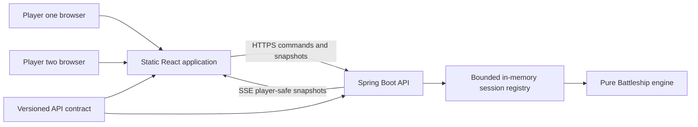
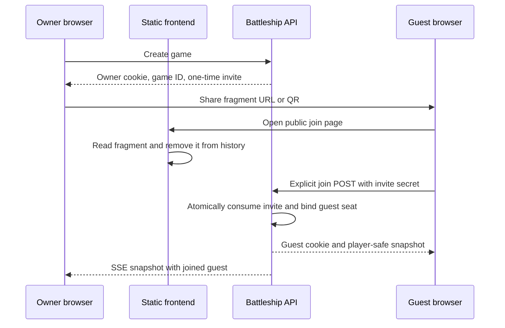

# Recommended Rewrite Architecture — Production-Ready Anonymous Battleship

## 1. Executive recommendation

Rewrite the application as three independently versioned products:

1. **`battleship-contracts`** — the language-neutral HTTP, event, JSON Schema, examples, and compatibility contract.
2. **`battleship-backend`** — a single-instance Spring Boot service with a pure server-authoritative game engine, bounded in-memory session registry, anonymous capability security, REST commands, and Server-Sent Events (SSE).
3. **`battleship-web`** — a static React/TypeScript application that knows only the published contract and runtime endpoint configuration.

The recommended runtime is a **modular monolith**, not microservices. The frontend and backend are separate builds and deployments, but the backend remains one coherent process because all game state is intentionally in memory. The contract is the only coupling point, so either implementation can be replaced without importing code from the other.

Use:

- HTTPS REST for commands and authoritative snapshots;
- one authenticated SSE stream per player for near-realtime updates;
- a monotonically increasing `gameVersion` for ordering and conflict detection;
- a client-generated `commandId` for safe retries;
- player-specific server projections so hidden opponent data never reaches the wrong browser;
- high-entropy anonymous capabilities in secure HttpOnly cookies;
- a one-time invitation secret carried in the URL fragment and explicitly redeemed with `POST`;
- a bounded, single-process in-memory registry with expiry, capacity admission, cleanup, and overload behavior;
- a policy-driven rules engine with accurately named, immutable, versioned rulesets.

This can be **production-hardened but not durable**. With no database or shared state, a process restart, redeploy, host replacement, or scale-to-zero event destroys every active game. That limitation must be part of the product contract and UX. A free deployment can be a useful public demo, but it cannot honestly promise continuity for active games.

## 2. Evidence reviewed

The recommendation is based on:

- all ten reports in `/Users/ok/Documents/Codex/Battleship`; reports 04 and 10 are byte-identical, so the corpus contains nine distinct analyses;
- the live `battleship_java` source, tests, API artifact, build, container, and documentation on clean `master` as of 2026-08-18;
- current official documentation for Spring MVC/Security, OWASP, browser SSE/WebSocket behavior, OpenAPI, Cloudflare Pages, Render, Koyeb, Vercel, Railway, and Fly.io.

The research consistently supports a server-authoritative, contract-first, bounded single-node design. The main tension in the reports is transport/authentication: WebSocket is reasonable for a JavaScript-held bearer credential, while SSE is simpler and safer when an API cookie can authenticate the browser. This document selects cookie-authenticated SSE and defines the deployment topology around that decision.

## 3. What the current application teaches us

### 3.1 Strengths to retain conceptually

| Current strength | Evidence | Rewrite treatment |
|---|---|---|
| Frontend adapter seam with HTTP and mock implementations | [`GameAdapter.ts`](/Users/ok/Development/GitHub/battleship_java/frontend/src/adapters/GameAdapter.ts) and [`App.tsx`](/Users/ok/Development/GitHub/battleship_java/frontend/src/App.tsx) | Retain as a contract-facing `GameGateway`; quarantine generated transport code behind it. |
| Backend layers and explicit in-memory implementation | [`BeansConfiguration.java`](/Users/ok/Development/GitHub/battleship_java/src/main/java/ua/kostenko/battleship/battleship/web/config/BeansConfiguration.java) | Replace with stricter domain/application/infrastructure/API modules. |
| Per-session mutation serialization and post-lock publication | [`GameControllerApiImpl.java`](/Users/ok/Development/GitHub/battleship_java/src/main/java/ua/kostenko/battleship/battleship/logic/api/impl/GameControllerApiImpl.java) | Retain the semantic guarantee, but move the lock, state, dedupe, replay, expiry, and subscribers into one `SessionSlot`. |
| Opponent ships are projected per player rather than merely hidden in CSS | [`FieldManagementImpl.java`](/Users/ok/Development/GitHub/battleship_java/src/main/java/ua/kostenko/battleship/battleship/logic/engine/FieldManagementImpl.java) and [`SessionEventBroadcaster.java`](/Users/ok/Development/GitHub/battleship_java/src/main/java/ua/kostenko/battleship/battleship/web/sse/SessionEventBroadcaster.java) | Make `viewFor(seat)` a mandatory boundary for every response and event. |
| SSE-first updates, foreground resync, stale fallback, and manual refresh | [`useSessionEvents.ts`](/Users/ok/Development/GitHub/battleship_java/frontend/src/hooks/useSessionEvents.ts) | Retain the UX pattern, add versions, event IDs, bounded streams, and conditional snapshot recovery. |
| English/Ukrainian localization, responsive board layouts, accessible labels, QR sharing, and optional synthesized audio | [`frontend/src`](/Users/ok/Development/GitHub/battleship_java/frontend/src) | Retain the product intent; rebuild around a responsive design system and stricter accessibility contract. |
| Comprehensive local verification, including real packaged-JAR E2E | [`scripts/verify.sh`](/Users/ok/Development/GitHub/battleship_java/scripts/verify.sh) | Split into frontend, backend, contract, security, and deployed integration gates. |

### 3.2 Problems the rewrite should deliberately remove

| Current limitation | Consequence | Replacement |
|---|---|---|
| Session and player UUIDs in URL paths act as identity; there is no authentication or membership authorization. | Anyone who obtains a valid pair can act as that player. | Opaque anonymous capability; server derives membership and seat. No client-supplied `playerId`. |
| Sessions, per-session locks, and SSE registrations have no business expiry or capacity admission. | Abandoned or abusive traffic can retain memory for the process lifetime. | Hard game/connection caps, TTL, absolute lifetime, cleanup, bounded queues/maps, `429`/`503` overload behavior. |
| `GameState` is a record containing mutable players, fields, and collections. Reads are not serialized. | Snapshots can observe or retain mutable state; reasoning and concurrency testing are harder. | Deeply immutable aggregate values and atomic replacement under a session slot. |
| SSE emitters never time out and synchronous fan-out has no version, event ID, replay rule, or backpressure policy. | Slow clients and reconnect races are not explicitly bounded or ordered. | Finite stream lifetime, coalescing queue of size one, `id = gameVersion`, snapshot-on-connect, bounded replay optimization, slow-client disconnect. |
| Browser routing trusts locally stored stage/player data. | Local storage can be stale or cleared independently of server truth. | URL carries only `gameId`; authenticated snapshot determines the route and allowed actions. |
| Rotate is composed client-side from delete then add. | Failure between calls can remove a ship. | Atomic `MOVE_SHIP` or `ROTATE_SHIP` command. |
| One shared rule implementation applies no-touch placement and hit-keeps-turn behavior to both current editions. | The mode labels do not faithfully represent researched Hasbro rules. | Explicit, versioned `Ruleset` policies with rule-to-test traceability. |
| `MILTON_BRADLEY` currently has a 10-ship, 30-cell fleet rather than the researched classic 5/4/3/3/2 fleet. | The label is both historically broad and mechanically misleading. | Use an exact product/year-derived ruleset identifier. |
| Frontend and backend are built into one JAR and use hardcoded same-origin API paths. | Replacement and independent deployment are possible only after code changes. | Separate artifacts plus validated runtime config. |
| No hosted CI, infrastructure contract, or production configuration profile. | Local quality is strong, but production delivery is not reproducible remotely. | Independent pipelines, container/image policy, deployment manifests, contract compatibility gates, and environment validation. |

The rewrite should not preserve the existing endpoint shapes merely because they are documented. The old application is behavioral context and a regression reference, not the target architecture.

## 4. Goals, constraints, and explicit non-goals

### Goals

- Two private player seats without registration.
- A leaked/public game locator is insufficient to observe or control either seat.
- Frontend and backend are independently replaceable and deployable.
- Server-authoritative, deterministic, testable game logic.
- Near-realtime state convergence across both browsers.
- Correct recovery from duplicate requests, delayed events, reconnects, and stale tabs.
- Hard bounds on every attacker-controlled resource.
- Responsive, modern, localized, keyboard/touch/pointer-accessible UI.
- Containerized backend and static frontend suitable for free demo hosting and a paid always-on production host.

### Non-goals for the first release

- Registered accounts, passwords, profiles, social login, or account recovery.
- Database persistence, durable match history, replay after a process crash, or zero-downtime failover.
- Multiple backend replicas, spectators, tournaments, matchmaking, chat, or moderation.
- Offline gameplay or accepting commands while disconnected.
- An authoritative game engine in the frontend.
- Compatibility with the existing `/api/v2/game` contract.

These exclusions are important. Chat, spectators, accounts, and multi-instance operation would materially change security, privacy, persistence, and transport requirements.

## 5. Architecture options

| Option | Summary | Advantages | Costs and risks | Decision |
|---|---|---|---|---|
| **A. REST commands + SSE snapshots** | Static SPA, Spring MVC API, one SSE stream per seat, snapshot recovery | Matches server-to-browser update direction; browser reconnect support; ordinary HTTP auth, CSRF, errors, retries, and observability; simple fallback | Requires testing proxy buffering/timeouts and bounding async emitters | **Recommended** |
| B. REST commands + WebSocket events | REST still changes state; WebSocket carries updates | Good if chat/presence or higher-frequency bidirectional features arrive | More handshake/origin/auth lifecycle, reconnect protocol, message limits, heartbeat code; no browser API backpressure; still needs snapshots/versioning/idempotency | Keep as a future transport adapter, not v1 |
| C. Polling-first/serverless backend | Static frontend polls short-lived functions | Simplest hosting surface and broad proxy compatibility | Increased latency and request load; in-memory sessions do not fit horizontally scheduled/serverless functions; still needs affinity/shared state | Reject; use adaptive conditional polling only as degraded mode |

WebFlux, actors, event sourcing, Kafka, Redis, and microservices are not justified by the workload. Spring MVC with virtual threads or a properly configured async executor is sufficient until measurement proves otherwise.

## 6. Target system context



The contract bundle defines what crosses the network. The backend does not serve or import frontend source, and the frontend does not import backend classes. A deployment may expose both under one public site or related subdomains, but the artifacts remain independent.

### Recommended repositories

```text
battleship-contracts/
  openapi.yaml
  schemas/
  examples/
  compatibility-policy.md
  changelog.md

battleship-backend/
  game-domain/
  game-application/
  game-infrastructure/
  game-api/
  game-boot/

battleship-web/
  src/app/
  src/contracts/
  src/gateway/
  src/features/
  src/sync/
  src/ui/
  public/runtime-config.json
```

A monorepo is acceptable only if CI proves the same boundaries and produces separate versioned artifacts. Separate repositories make the replaceability requirement more obvious and are the recommended default.

## 7. Backend design

### 7.1 Module responsibilities

| Module | Owns | Must not depend on |
|---|---|---|
| `game-domain` | Rulesets, coordinates, fleets, board state, phases, commands, transitions, domain events, invariants | Spring, HTTP, Jackson, cookies, repositories, clocks, random generators, logging |
| `game-application` | Create/join/command/query/subscribe use cases, authorization ports, player projections | Servlet types or concrete in-memory maps |
| `game-infrastructure` | Session registry, per-game slots, token hashing, capacity permits, TTL sweeper, rate limits, subscriber hub, metrics | Frontend concerns or API DTOs |
| `game-api` | Controllers, request validation, DTO mapping, Problem Details, CORS/CSRF/security integration, SSE framing | Mutable/raw domain serialization |
| `game-boot` | Composition root, configuration properties, Actuator, executors, scheduling, graceful shutdown | Domain decision logic |

Physical Maven modules are preferred because they let dependency rules fail the build, but the architecture does not require independently deployed backend services.

### 7.2 Pure transition engine

The core operation is conceptually:

```java
Transition apply(GameState state, GameCommand command, Ruleset ruleset)
```

For identical values, it returns an identical next state and domain-event list. It does not read time, create IDs, generate randomness, perform I/O, publish SSE, or mutate its input. Clocks, secure random sources, identifiers, registry access, and transport belong outside the engine.

The aggregate owns:

- `gameId`, `gameVersion`, `rulesetId`, `phase`, and `turn`;
- exactly two seats, their display names, readiness, fleets, and boards;
- accepted shots and outcome;
- ruleset-specific turn/salvo state;
- invariant validation after every accepted transition.

Recommended phases:

```text
WAITING_FOR_GUEST → PLACEMENT → PLAYING → FINISHED
                                  └──────→ ABANDONED
```

The owner is created with the game. The guest is added only by atomic invitation redemption. Both can place ships concurrently. `READY` commits the current fleet and is irreversible in v1; when both seats are ready, the server chooses the starting seat according to the ruleset policy. `RESIGN` is available during play. Expiry is lifecycle state outside the retained game aggregate because the registry removes the session.

### 7.3 Policy-driven rulesets

Do not model “edition” as an enum that selects only fleet size. A `Ruleset` is immutable and versioned, and includes:

- board dimensions and coordinate labels;
- fleet multiset and ship geometry;
- permitted orientations;
- overlap and adjacency policy;
- shot allocation per turn;
- whether a hit or sink retains the turn;
- when shot results are disclosed;
- repeated-shot behavior;
- automatic water marking around a sunk ship;
- first-player policy;
- victory condition and end-game reveal policy.

Recommended release sequence:

| Ruleset ID | Product label | Core behavior | Release |
|---|---|---|---|
| `sea-battle-10-ship.v1` | Sea Battle | 10×10; fleet 4×1, 3×2, 2×3, 1×4; ships cannot touch orthogonally or diagonally; one shot at a time; hit/sink retains turn; surrounding water may be marked after sink | Initial |
| `hasbro-classic-2002.v1` | Battleship Classic 2002 | 10×10; Carrier 5, Battleship 4, Destroyer 3, Submarine 3, Patrol Boat 2; horizontal/vertical; no overlap; no extra separation rule; one shot; turn ends after hit or miss | Initial |
| `hasbro-salvo-2002.v1` | Battleship Salvo | Same classic fleet; shots per turn equal the firing player’s surviving ships; one atomic salvo command resolves distinct coordinates with ruleset-defined ordering and disclosure | Second release |
| `starex-salvo-1931.v1` | Historical Salvo 1931 | Four-ship historical fleet, diagonal placement, six-shot opening and weighted shot loss | Later specialist mode |

Display names and localization are separate from stable IDs. Do not call the first mode `UKRAINIAN`: the research found no single official Ukrainian ruleset. Do not call the second merely `MILTON_BRADLEY`: the manufacturer’s rules changed over time.

Each published ruleset is immutable. A correction creates a new ID/version so in-progress games never change mechanics.

### 7.4 Session slot and concurrency

The in-memory authority is a custom bounded registry:

```text
SessionRegistry
  gameId -> SessionSlot

SessionSlot
  lock
  immutable GameState reference
  membership capability digests
  one-time invite digest/state
  bounded command-result ring per seat
  bounded event replay ring
  at most one active subscriber per seat
  monotonic lastMeaningfulAccess
  createdAt and expiresAt
```

Creation first acquires a global capacity permit and only then inserts a game. Do not use `map.size() < limit` for admission. A permit is released exactly once when the session is removed.

Every game mutation executes under that slot’s short lock:

1. authenticate capability and derive seat;
2. reject expired/removed session;
3. normalize and fingerprint the command;
4. check `commandId` dedupe before version precondition;
5. validate expected version and seat/action authorization;
6. apply the pure transition;
7. atomically replace state and increment `gameVersion` once;
8. store the bounded result and event envelope;
9. release the lock;
10. notify subscribers without performing unbounded work on the command thread.

Unrelated games never share a mutation lock. Reads obtain one immutable state reference, then project it outside the lock. Removing a session closes streams, clears rings and membership entries, releases capacity, and removes the slot in one lifecycle operation.

### 7.5 Player-safe projections

The domain aggregate is never serialized directly. `GameViewProjector.viewFor(state, seat)` produces the only representation API and SSE code may expose.

The projection includes:

- the caller’s full fleet and board;
- only legally revealed opponent cells and aggregate information;
- server-derived seat and allowed commands;
- phase, turn, outcome, ruleset summary, `gameVersion`, `serverEpoch`, and expiry;
- no capability, invite digest, internal command history, raw opponent placement, lock, subscriber, or abuse-control data.

A strong negative test uses two internal games that differ only in undiscovered opponent ship positions and proves their opponent-facing JSON is identical.

## 8. Anonymous private-session security

### 8.1 Capability model

Registration is unnecessary. Possession of a random secret authenticates an anonymous browser session; server-side membership authorizes that session as owner or guest in a specific game.

- Generate 32 random bytes with a cryptographically secure generator for the browser capability.
- Store only a SHA-256 digest in the in-memory registry; the token is already uniformly random, so password hashing is unnecessary.
- Send it as a host-only `Secure; HttpOnly; SameSite=Strict; Path=/` API cookie.
- Never put the player capability in a query string, fragment, log, metric, error, or frontend-readable storage.
- Derive the seat from membership. Reject client fields such as `playerId`, `role`, `isOwner`, `turn`, or `winner` as authority.

One browser profile represents one anonymous identity. Supporting both opponents in two tabs of one profile is deliberately excluded from v1; use another device, browser profile, or private window. This avoids weakening credential storage to a JavaScript-readable tab token.

### 8.2 Invitation model

The public `gameId` is a locator, not a credential. Creating a game also creates a separate 128–256-bit one-time guest invitation secret. Store only its digest.

Recommended URL:

```text
https://app.example.com/join/<publicGameId>#invite=<oneTimeSecret>
```

The fragment is not sent in the HTTP request. The frontend reads it, immediately removes it from browser history with `history.replaceState`, and displays an explicit **Join game** action. It does not redeem automatically. `GET` and `HEAD` remain side-effect free, so link scanners cannot claim the seat.



Two concurrent redemption attempts are serialized in the same `SessionSlot`; exactly one succeeds. Regenerating the invite revokes the previous unused invite. A consumed invite can never authorize gameplay.

### 8.3 Browser and API defenses

- Keep Spring Security CSRF protection for unsafe requests. Expose a separate CSRF token to the SPA and require the corresponding header.
- Allow only exact configured frontend HTTPS origins; credentialed CORS never uses `*`.
- Process CORS before Spring Security so preflight requests work correctly.
- Validate `Origin` and Fetch Metadata on state-changing requests as defense in depth.
- Enforce strict JSON content types, schema validation, small body limits, field lengths, Unicode normalization, and safe text rendering.
- Use a restrictive CSP with no third-party scripts on invite or game pages. Do not use remote QR, analytics, ad, chat, or tag-manager JavaScript there.
- Send `Referrer-Policy: no-referrer` on invite/game pages, `X-Content-Type-Options: nosniff`, clickjacking protection, and HSTS after HTTPS is fully configured.
- Return `Cache-Control: no-store` for authenticated snapshots, command results, invite responses, and SSE.
- Rate-limit creation, invite redemption, commands, snapshot reads, and stream opens by bounded per-source and per-capability keys.
- Log event type, outcome, game correlation hash, latency, and version; never raw cookies, invite tokens, full URLs containing fragments, player boards, or names unless explicitly required and privacy-reviewed.

The design protects private seats from guessing and ordinary link sharing. It cannot protect a seat after the user deliberately shares their cookie/device, after successful XSS, or against a host/process compromise.

## 9. Contract-first API

### 9.1 Contract ownership and evolution

`battleship-contracts` publishes an immutable semantic version containing:

- OpenAPI for HTTP and SSE entry points;
- JSON Schemas for snapshots, commands, event envelopes, and RFC 9457 problems;
- examples for waiting, placement, playing, finished, conflict, expiry, and restart;
- compatibility rules and changelog.

Use OpenAPI 3.1.x until the entire selected generator/linter/validator toolchain proves a newer version. Generate TypeScript transport types/client and backend conformance tests independently. The frontend wraps generated code; components never depend on generator classes. Runtime JSON validation occurs before network data enters the client cache and tolerates unknown additive response fields.

Distinguish:

- contract release, for example `1.4.2`;
- API major, for example `/api/v1`;
- per-game state revision, for example `gameVersion: 42`.

Breaking wire changes use a new API major with a migration window. Additive fields/events remain backward compatible.

### 9.2 Recommended resource surface

```text
GET  /api/v1/rulesets
GET  /api/v1/meta
POST /api/v1/games
POST /api/v1/games/{gameId}/join
GET  /api/v1/games/{gameId}/snapshot
POST /api/v1/games/{gameId}/commands
GET  /api/v1/games/{gameId}/events
POST /api/v1/games/{gameId}/invite/rotate
POST /api/v1/games/{gameId}/leave
GET  /actuator/health
```

All game endpoints except ruleset discovery and initial creation require the anonymous browser cookie and exact game membership. Join additionally requires the unused invite secret.

Every accepted command returns an authoritative player-safe snapshot. Representative envelope:

```json
{
  "commandId": "018f...",
  "expectedVersion": 17,
  "type": "FIRE",
  "payload": { "row": 5, "column": 7 }
}
```

Also require `If-Match: "game-<id>-v17"`; if both header and body version are present, they must agree. Command types include `PLACE_SHIP`, `MOVE_SHIP`, `ROTATE_SHIP`, `REMOVE_SHIP`, `READY`, `FIRE`, `FIRE_SALVO`, and `RESIGN`, with ruleset/phase-specific allowance.

Representative snapshot fields:

```json
{
  "contractMajor": 1,
  "serverEpoch": "random-per-process-start",
  "gameId": "public-locator",
  "gameVersion": 18,
  "ruleset": { "id": "sea-battle-10-ship.v1", "board": { "rows": 10, "columns": 10 } },
  "phase": "PLAYING",
  "you": { "seat": "OWNER", "displayName": "Alex" },
  "opponent": { "displayName": "Sam", "connected": true },
  "turn": "GUEST",
  "ownBoard": {},
  "opponentBoard": {},
  "allowedCommands": [],
  "expiresAt": "2026-08-18T20:00:00Z",
  "outcome": null
}
```

The contract defines cell and ship shapes exactly; `{}` above only keeps this architecture example compact.

### 9.3 Error semantics

Use RFC 9457 Problem Details with a stable application `code`, correlation ID, and no secret/internal state.

| Situation | HTTP behavior |
|---|---|
| Missing/invalid anonymous capability | `401` |
| Valid capability without membership/action authority | `403` |
| Unknown game to an unauthenticated/nonmember caller | generic `404` |
| Backend can still prove the game expired during the current process lifetime | `410` with current `serverEpoch` |
| Game is absent after cleanup or restart | generic `404`; client compares `/api/v1/meta.serverEpoch` and its cached expiry to explain the cause honestly |
| Missing version precondition | `428` |
| Stale expected version | `412`; client fetches current snapshot |
| Legal identity but illegal domain command, consumed invite, or command-ID fingerprint mismatch | `409` |
| Schema or field validation failure | `400` or `422`, consistently defined in the contract |
| Rate limit | `429` with bounded retry guidance |
| Capacity or draining | `503` with retry guidance; never allocate first and reject later |

If the same `commandId` and fingerprint are retried, return the recorded result even when its original expected version is now stale. If the same ID is reused for different content, return `409`.

## 10. Near-realtime synchronization

SSE is an optimization over the snapshot endpoint, not a second source of truth.

### Stream contract

```text
GET /api/v1/games/{gameId}/events
Accept: text/event-stream
Cookie: anonymous capability
```

- Authenticate and authorize before allocating the emitter.
- Register the seat subscription and capture the initial state atomically with game mutation.
- Send an immediate full player-safe `snapshot` event.
- Set SSE `id` to the decimal `gameVersion` and include the random per-process `serverEpoch`.
- Send heartbeat comments around every 15 seconds; heartbeats do not extend game TTL.
- Allow one live stream per seat. A new connection replaces the old one.
- Use a coalescing outbound buffer: at most one unsent newest snapshot per subscriber.
- Disconnect slow or repeatedly failing clients rather than accumulating messages.
- Use a finite stream lifetime (initially 20 minutes) so infrastructure and cleanup paths are exercised; browser reconnection is expected.
- Keep a small bounded replay ring only as an optimization. Correctness always recovers from the latest full snapshot.

On `Last-Event-ID`, replay contiguous authorized snapshots if still retained; otherwise send the current snapshot. A client applies only snapshots from the current `serverEpoch` whose `gameVersion` is greater than its cached version.

### Browser recovery

1. While SSE is healthy, events update the single server-state cache.
2. A command response and an SSE event race safely because only the greater version is applied.
3. On tab foregrounding, fetch a conditional snapshot immediately.
4. If SSE remains unavailable, use conditional adaptive polling with `ETag`/`If-None-Match`, beginning near 2 seconds and backing off to 5–10 seconds.
5. Disable commands while the result of a prior command is unknown; retry the same `commandId` or reconcile the snapshot.
6. If `/api/v1/meta.serverEpoch` changes, explain that the ephemeral server restarted. If the game returns `410` or its cached expiry elapsed, explain expiry. Otherwise describe the game as unavailable rather than inventing a cause.

No UI should announce a hit, miss, sink, turn, or winner until an authoritative response/snapshot says so.

## 11. Frontend architecture and UX

### 11.1 State ownership

- **TanStack Query** owns the one cached authoritative snapshot per game.
- React component state or reducers own selection, hover, dialog state, candidate placement, and animation state.
- `GameSync` owns connection health and installs newer validated snapshots into the query cache.
- Mutations own pending/unknown/conflict lifecycle and reuse a `commandId` on retry.
- The router owns `gameId`; the authenticated snapshot owns the phase and redirects.
- The browser capability remains in the HttpOnly cookie and is never frontend state.

Do not add Redux or Zustand initially. If the organization chooses Redux, use RTK Query as the single server-state cache instead of running two caches.

### 11.2 Replaceable integration boundary

The app loads and validates non-secret runtime configuration before rendering:

```json
{
  "apiBaseUrl": "https://api.example.com/api/v1",
  "contractMajor": 1,
  "release": "web-1.0.0"
}
```

The same frontend bytes can target local, staging, free-demo, or production APIs. The gateway owns base URL, `credentials: include`, CSRF header, ETag/version headers, timeouts, retries, runtime validation, Problem Details normalization, and SSE creation. UI features dispatch domain commands and never build URLs.

### 11.3 Modern responsive interface

- Use a tokenized design system with light/dark/high-contrast-aware colors, fluid spacing/type, and reusable primitives.
- On phones, show one dominant board at a time; during play prioritize the opponent targeting board and provide a labelled own/opponent board switch.
- On tablets/desktops, show two bounded boards side by side without enlarging them indefinitely.
- On short landscape screens, place the board beside a scrollable status/action rail. Never require or lock orientation.
- Respect safe-area insets, dynamic viewport units, browser zoom, text enlargement, and Ukrainian content expansion.
- Represent placement in logical coordinates. Dragging with Pointer Events is an enhancement; select ship → select cell → confirm is always available by touch/click and keyboard.
- Provide explicit rotate, move, remove, cancel, ready, fire, refresh, copy link, and show QR controls. Avoid long-press-only or multi-touch-only actions.
- Use native `<dialog>` for true modals and platform popover behavior for nonmodal action surfaces where supported.
- Keep last-known boards visible during reconnect, visibly mark them stale, and pause unsafe commands.
- Treat an unknown command outcome as “checking result,” not “failed; try again.”
- Use restrained visual effects, optional synthesized audio/haptics after user interaction, and `prefers-reduced-motion` fallbacks.
- Cache only the static application shell as a PWA. Never cache authenticated API/SSE responses or queue offline game commands.

### 11.4 Accessibility contract

- Full keyboard operation with roving focus/arrow navigation on boards.
- Every cell exposes coordinate, availability, and known result in text; color is never the only state cue.
- Visible `:focus-visible`, sufficient contrast, and no focus obscured by sticky panels/sheets.
- `role="status"` for ordinary progress/state changes and `role="alert"` only for important time-sensitive failures.
- Dialog focus enters, is contained, escapes where cancellation is allowed, and returns logically.
- English and Ukrainian use whole translated messages; update the document `lang` attribute.
- Automated accessibility checks plus manual keyboard, screen-reader, zoom, touch, and orientation testing at defined viewport/assistive-technology matrices.

## 12. Session lifecycle and resource limits

Recommended initial policy, treated as conservative configuration rather than universal capacity proof:

| Control | Initial value | Semantics |
|---|---:|---|
| Active games | 100 | Hard admission cap; measure retained heap before increasing |
| Active SSE streams | 200 | One per seat; separate hard cap |
| Idle TTL | 15 minutes | Extended only by accepted commands or explicit presence from a visible active UI; ordinary reads, fallback polling, SSE heartbeats, and automatic reconnects do not extend it |
| Absolute lifetime | 2 hours | Prevents automated clients retaining memory forever |
| Finished-game retention | 5 minutes | Allows result display/reconnect, then removes session |
| Invite lifetime | 15 minutes or game idle expiry, whichever comes first | One-time and revocable |
| Recent command results | 64 per game | Bounded dedupe ring |
| Replay snapshots | 16 per game | Optimization only |
| Streams per seat | 1 | New replaces old |
| SSE heartbeat | 15 seconds | Does not extend TTL |
| SSE maximum lifetime | 20 minutes | Forces healthy reconnect/cleanup |
| JSON request body | 16 KiB | Endpoint-specific limits may be smaller |

Use one scheduled sweeper plus an expiry check on every access. Use monotonic time for elapsed-duration decisions and wall-clock `Instant` only for human-facing timestamps. Cleanup must be idempotent and safe against a simultaneous command or reconnect.

Rate limits also need hard bounded key storage. Sensible starting points are 5 game creations/minute/source, 20 invite attempts/minute/source, 60 commands/minute/capability, and small concurrent connection limits. Load/security tests—not guesses—must tune them for the selected host.

## 13. Operations and deployment

### 13.1 Runtime requirements

- One and only one backend replica while state is local memory. Sticky sessions are insufficient as an architecture guarantee.
- TLS end to end; trust forwarded headers only from known platform proxies.
- Non-root, read-only container filesystem where the platform permits it.
- Pin Java/Spring/base-image versions and automate dependency/security updates.
- Deliberately size JVM heap below the container limit; leave room for metaspace, code cache, thread stacks, TLS/network buffers, and native memory. Measure with the actual image/host.
- Explicit async executor/SSE limits; do not use unbounded queues.
- Liveness checks process health. Readiness fails during startup, capacity emergencies, and graceful draining.
- Only health is public; protect metrics and configuration endpoints.
- Graceful shutdown stops admission, emits `server-draining` where possible, closes streams, and waits briefly for in-flight commands. It cannot preserve games.

### 13.2 Observability

Low-cardinality metrics:

- active/created/expired/finished games;
- active/rejected/failed SSE streams;
- command count, latency, conflicts, dedupe hits, authorization failures, rate-limit rejections;
- invite creation/redemption/failure;
- registry capacity and cleanup duration;
- JVM heap/native memory/GC, process RSS, thread/executor queue counts;
- restart `serverEpoch` and graceful/abrupt shutdown count.

Never label metrics by game ID, player name, capability, IP, coordinate, or ruleset combination with unbounded cardinality. Use structured logs with secret redaction and short retention appropriate to a low-data anonymous game.

### 13.3 Hosting profiles

| Profile | Frontend | Backend | Honest guarantee |
|---|---|---|---|
| Production-hardened ephemeral | Static CDN/Cloudflare Pages under `app.example.com` | Always-on single Spring container under `api.example.com` | Correct/private/bounded while process lives; active games lost on process failure or deployment |
| Zero-cost demo | Cloudflare Pages free | One Render Free Spring service | Hobby/demo only; may sleep after 15 minutes without qualifying inbound traffic, cold start about a minute, may restart anytime, and all games vanish |
| Zero-cost alternative | Static host | Koyeb free instance | 512 MB/0.1 vCPU class, scale-to-zero after idle, cold starts, no continuity guarantee |

Cloudflare Pages currently documents free/unlimited static asset requests, while Pages Functions share Workers quotas. Render explicitly says its free instances must not be used for production; they spin down after 15 minutes without inbound traffic, can restart at any time, and have ephemeral files. Koyeb explicitly describes its free instance/scale-to-zero constraints. Provider facts must be rechecked immediately before deployment.

For the cookie profile, prefer related HTTPS subdomains under one registrable custom domain. If unrelated provider default domains are used, do not silently weaken the design to fragile cross-site third-party cookies. Use a proven same-origin edge proxy or a deliberately documented JavaScript-bearer demo profile with its higher XSS risk. The production recommendation remains related-site, host-only API cookies and exact credentialed CORS.

Relevant official sources: [Cloudflare Pages pricing](https://developers.cloudflare.com/pages/functions/pricing/), [Render free-service limits](https://render.com/docs/free), [Render WebSockets](https://render.com/docs/websocket), [Koyeb instances](https://www.koyeb.com/docs/reference/instances), [Koyeb scale-to-zero](https://www.koyeb.com/docs/run-and-scale/scale-to-zero), [Vercel Hobby](https://vercel.com/docs/plans/hobby), [Railway pricing](https://docs.railway.com/pricing), and [Fly.io cost guidance](https://fly.io/docs/about/cost-management/).

## 14. Verification architecture

| Layer | Required proof |
|---|---|
| Rules/domain | Example tests per published rule; invariant/property tests over command sequences; repeat-shot, adjacency, salvo, sink, victory, and hidden-information behavior; mutation testing |
| Determinism | Fixed/mutable clock, deterministic ID/random sources, seeded generators with reproducible failing seeds; no sleeping tests |
| Application | Creation/join/one-time invite races; same-game command serialization; unrelated-game parallelism; dedupe-before-version ordering; expiry boundary races; permit release; cleanup idempotence |
| Security/projection | Authorization matrix for every endpoint/seat/phase; CSRF/CORS/origin/header tests; secret-redaction tests; two-state privacy equivalence; malformed/oversized/fuzzed input |
| Contract | OpenAPI/Schema lint and examples; backward-compatibility check; generated-client compilation; backend conformance; frontend runtime-validation fixtures |
| Realtime | Subscribe/mutate race; event IDs and ordering; reconnect/Last-Event-ID; replay miss; process epoch change; slow client; stream replacement; heartbeat and TTL independence |
| Frontend | Gateway tests; query-cache version guards; pending/unknown/conflict flows; component interaction; accessibility; real Ukrainian layout; responsive screenshots |
| Browser E2E | Two isolated browser contexts create, invite, join, place, ready, play, reconnect, finish, expire, and observe restart; prove no opponent secret appears on wire |
| Operational | Container smoke; startup/readiness/draining; load/soak at 100 games/200 streams; churn/leak test; constrained-memory test; rate-limit and capacity rejection; actual-host proxy buffering/timeout test |

The test pyramid should be domain-heavy. Browser tests prove critical integration and UX, not every rules combination. The frontend mock must replay contract fixtures/state transitions supplied by tests; it must not become a second Battleship engine.

## 15. Delivery and release model

Each repository has its own pipeline.

### Contracts

1. Lint and validate OpenAPI/JSON Schema/examples.
2. Run compatibility analysis against the last release.
3. Generate and compile representative Java and TypeScript clients/validators.
4. Publish an immutable tagged contract artifact and changelog.

### Backend

1. Compile, format/static analysis, architecture dependency rules.
2. Domain/application/API/security/realtime tests and coverage quality gates.
3. Contract conformance against a pinned contract release.
4. Dependency and container scanning, SBOM, non-root container smoke.
5. Load/soak and host-profile gates for release candidates.

### Frontend

1. Typecheck, lint, unit/component/accessibility tests.
2. Compile generated client and runtime validators from the pinned contract.
3. Production build scan: no unexpected remote assets/scripts or embedded secrets/endpoints.
4. Browser E2E against a contract-compatible test backend.
5. Publish one immutable static artifact; environment differences come from validated runtime config.

Release additive backend changes before a frontend that uses them. Remove old fields/endpoints only after the supported frontend range no longer needs them. Run a deployed two-browser smoke test after both artifacts are promoted.

## 16. Suggested rewrite sequence

1. **Approve product policies:** initial two rulesets, 15-minute meaningful-activity TTL, two-hour absolute life, one-browser-one-identity, no reconnect recovery after cookie loss, and process-loss behavior.
2. **Publish contract v1:** resource model, snapshots, command union, problems, event envelope, security scheme, and examples.
3. **Build the pure engine:** ruleset validation, immutable state, commands/transitions, projections, deterministic/property/mutation tests.
4. **Build the application/registry:** capabilities, invite redemption, capacity, per-slot serialization, versioning, dedupe, expiry, cleanup.
5. **Expose secure REST + SSE:** Spring Security/CSRF/CORS, Problem Details, bounded streams, observability, container.
6. **Build the independent SPA:** runtime config, gateway, generated contract adapter, query/sync layer, responsive accessible UI, PWA shell.
7. **Prove the complete system:** two-browser security/privacy flows, reconnect/restart UX, load/soak, constrained-memory, and actual free-host deployment.
8. **Retire the old application:** keep screenshots and selected behavioral tests as references; do not migrate live sessions because they are intentionally ephemeral.

This is a sequence of independently reviewable deliverables, not a request to preserve the old internal design.

## 17. Recommended decisions for review

The draft makes these concrete choices so implementation is not blocked by hidden ambiguity:

1. Ship `sea-battle-10-ship.v1` and `hasbro-classic-2002.v1` first; add Salvo after the core is proven.
2. Persist each placement as an atomic server command; `READY` commits and is irreversible in v1.
3. Use REST commands + cookie-authenticated SSE, not WebSocket, for v1.
4. Use one anonymous HttpOnly browser capability with server-side per-game membership.
5. Treat the invitation as a separate one-time secret in the URL fragment; explicit POST redemption only.
6. Do not support both players in ordinary tabs of one browser profile.
7. Expire after 15 minutes of meaningful authenticated inactivity, enforce a two-hour absolute lifetime, and do not let heartbeats/reconnects keep a game alive.
8. Permit exactly one backend replica; restarts destroy games and produce a clear terminal UX.
9. Use full player-safe snapshots as the recovery primitive; replay rings are bounded optimizations.
10. Target 100 active games/200 streams initially and require measurement before raising the caps.
11. Keep chat, spectators, accounts, durable history, and offline commands out of v1.

## 18. Primary references

### Research corpus

- [Rules, history, and domain modeling](/Users/ok/Documents/Codex/Battleship/01.%20Battleship%20Rules%20and%20Editions%20%E2%80%94%20Rules,%20History,%20and%20Domain-Modeling%20Research.md)
- [Near-realtime architecture](/Users/ok/Documents/Codex/Battleship/02.%20Near-Realtime%20Web%20Game%20Updates.%20Technology-Neutral%20Research%20and%20Architecture%20Recommendation.md)
- [Contract-first React frontend](/Users/ok/Documents/Codex/Battleship/03.%20Independent%20Contract-First%20React%20Frontend%20for%20a%20Server-Authoritative%20Battleship%20Game.md)
- [Production Java/Spring architecture](/Users/ok/Documents/Codex/Battleship/04.%20Production%20Java%3ASpring%20Architecture%20for%20an%20Anonymous%20Ephemeral%20Battleship%20Game.md)
- [Responsive frontend UX](/Users/ok/Documents/Codex/Battleship/05.%20Responsive%20Battleship%20Frontend%20UX%20Research.md)
- [Reference implementation analysis](/Users/ok/Documents/Codex/Battleship/06.%20Battleship%20Reference%20Implementations.%20Architecture,%20Rules,%20Realtime,%20Testing,%20Security,%20and%20Adaptation.md)
- [Registration-free security architecture](/Users/ok/Documents/Codex/Battleship/07.%20Security%20Architecture%20for%20a%20Registration-Free%20Two-Player%20Browser%20Game.md)
- [Deterministic engine testing](/Users/ok/Documents/Codex/Battleship/08.%20Deterministic%20Battleship%20Engine%20Testing%20Without%20a%20Database.md)
- [Free-host operations](/Users/ok/Documents/Codex/Battleship/09.%20Operating%20an%20Ephemeral%20Realtime%20Game%20on%20Free%20Hosting.md)

Report 10 is an exact duplicate of report 04 and adds no separate evidence.

### External primary/official sources

- [Hasbro Battleship 1990 rules](https://www.hasbro.com/common/instruct/Battleship.PDF)
- [Hasbro Battleship 2002 rules](https://www.hasbro.com/common/instruct/BattleShip_%282002%29.PDF)
- [Starex Salvo 1931 scan](https://www.gamecatalog.org/rules/StarexNoveltyCo_Salvo.pdf)
- [WHATWG Server-Sent Events](https://html.spec.whatwg.org/multipage/server-sent-events.html)
- [MDN EventSource](https://developer.mozilla.org/en-US/docs/Web/API/EventSource)
- [Spring MVC asynchronous requests and SSE](https://docs.spring.io/spring-framework/reference/web/webmvc/mvc-ann-async.html)
- [Spring Security CSRF](https://docs.spring.io/spring-security/reference/servlet/exploits/csrf.html)
- [Spring Security CORS](https://docs.spring.io/spring-security/reference/7.0/servlet/integrations/cors.html)
- [OWASP Session Management](https://cheatsheetseries.owasp.org/cheatsheets/Session_Management_Cheat_Sheet.html)
- [OWASP Authorization](https://cheatsheetseries.owasp.org/cheatsheets/Authorization_Cheat_Sheet.html)
- [OWASP API resource-consumption guidance](https://owasp.org/API-Security/editions/2023/en/0xa4-unrestricted-resource-consumption/)
- [OpenAPI specification](https://spec.openapis.org/oas/latest.html)
- [RFC 9110 HTTP Semantics](https://www.rfc-editor.org/rfc/rfc9110.html)
- [RFC 9457 Problem Details](https://www.rfc-editor.org/rfc/rfc9457.html)
- [WCAG 2.2 Dragging Movements](https://www.w3.org/WAI/WCAG22/Understanding/dragging-movements.html)
- [WAI-ARIA grid pattern](https://www.w3.org/WAI/ARIA/apg/patterns/grid/)

## 19. Conclusion

The best rewrite is not a larger distributed system. It is a smaller, stricter one: a pure rules engine inside one bounded Spring process, an independent static frontend, and a precise versioned contract between them. Anonymous capability cookies and one-time invitations solve the registration-free privacy problem without treating room IDs as passwords. REST commands plus SSE snapshots provide near-realtime play without duplicating the engine in the browser. Hard resource limits, deterministic testing, player-safe projections, and honest restart semantics make the in-memory constraint operationally defensible.

The central trade-off remains unavoidable: **no database means no continuity guarantee across process loss**. Everything else in this architecture is designed so that, while the process is alive, the game is private, correct, bounded, observable, replaceable, and pleasant to use on any modern device.
