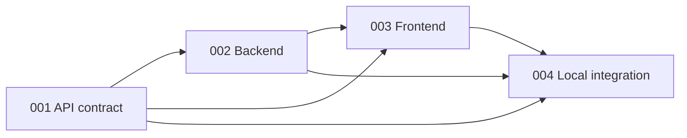

# Production-ready rewrite launch kit

This folder is the handoff from rewrite research to SpecKit delivery. It contains
the prompts and design inputs needed to reset the repository and build the new
application in four small, ordered features. The kit itself is documentation
only: creating these files does not delete the old application, initialize
SpecKit, or implement any product code.

## Read this first

Use the sources in this order when they disagree:

1. The approved decisions recorded in
   [`00-decisions-and-evidence.md`](00-decisions-and-evidence.md).
2. The rewrite architecture and interactive mockup under `../Design/`.
3. The research under `../Researches/`.
4. Current source and tests as evidence of useful behavior and known mistakes,
   never as an API compatibility promise.
5. Generic standards under `../Standards_and_recommendations/`.

Do not silently reopen a decision while implementing a later feature. If new
evidence contradicts an approved decision, stop that feature and explain the
conflict in simple language.

## Target repository

The rewrite is one monorepo with three independently buildable products:

```text
contracts/   authoritative HTTP, event, schema, and example contracts
backend/     domain, application, and Spring Boot app Maven modules
frontend/    independent React static application
```

The backend produces one executable JAR. That JAR contains no frontend assets.
The frontend produces static files and reaches the backend only through the
published contract.



The order is deliberate. Finish and integrate each feature into
`rewrite_prod_ready` before creating the next feature branch. This keeps the
contract authoritative and prevents parallel interpretations of unfinished
behavior.

## Branches and SpecKit directories

`rewrite_prod_ready` is the protected integration branch and is treated as the
rewrite's main branch. Never develop or commit directly on it.

| Unit | Work branch | SpecKit directory | Result |
|---|---|---|---|
| Repository reset and foundation | `feature/rewrite-foundation` with task branches named `feature/rewrite-foundation--<task>` | none | Clean repository, SpecKit, constitution, and portable agent setup |
| API contract | `feature/001-api-contract` | `specs/001-api-contract/` | `contracts/` only |
| Backend | `feature/002-backend` | `specs/002-backend/` | `backend/` only |
| Frontend | `feature/003-frontend` | `specs/003-frontend/` | `frontend/` only |
| Local integration | `feature/004-integration` | `specs/004-integration/` | Root scripts and cross-product documentation/tests |

Create every parent branch from the latest accepted `rewrite_prod_ready`. Use a
task branch for one reviewable implementation task and one commit. Final merge
of a parent branch into `rewrite_prod_ready` remains a developer action.

SpecKit 0.16.4 records its active feature directory separately from the Git
branch, so the `feature/` branch prefix and the numbered `specs/` directories
are compatible. After every SpecKit command, verify that its reported feature
directory is the one in the table.

## Exact execution order

### 1. Confirm the policy record

Read [`00-decisions-and-evidence.md`](00-decisions-and-evidence.md). Confirm that
the two rulesets, anonymous security model, lifecycle, restart behavior, and
excluded scope still match the intended product. This is the last policy review
before repository reset.

### 2. Preview and apply cleanup

Read [`01-cleanup/cleanup-manifest.md`](01-cleanup/cleanup-manifest.md), then use
[`01-cleanup/cleanup-prompt.md`](01-cleanup/cleanup-prompt.md) in a fresh task.
The prompt first prints the exact tracked deletion set. Review that output
before authorizing its separate apply step. It never removes untracked files.

Expected result: Git metadata, `LICENSE`, and all of
`docs/rewrite_context_doc/` remain; the prior tracked implementation and
project configuration are staged as recoverable Git deletions.

### 3. Create the fresh foundation

Follow
[`02-foundation/prerequisites-and-speckit-init.md`](02-foundation/prerequisites-and-speckit-init.md).
Initialize core SpecKit with the documented `specify init` command. Do not add
brownfield, memory-loader, Superpowers-bridge, CI, or deployment extensions.

Then invoke the `speckit-constitution` skill with the complete contents of
[`02-foundation/constitution-input.md`](02-foundation/constitution-input.md).
Build the portable Codex and Claude entry points from
[`02-foundation/agent-workflow-input.md`](02-foundation/agent-workflow-input.md).

Expected result: a reviewed constitution, lean SpecKit templates, a concise
canonical `AGENTS.md`, a minimal real `CLAUDE.md` import, shared project skills,
generated agent mirrors, and a local drift check. No application code exists
yet.

### 4. Deliver `001-api-contract`

Create `feature/001-api-contract` from the updated protected base.

1. Invoke `speckit-specify` with the entire contents of
   [`03-api/specify-input.md`](03-api/specify-input.md).
2. Run `speckit-clarify`; only genuinely unresolved product behavior may
   produce a question.
3. Invoke `speckit-plan` with
   [`03-api/hlsd-and-plan-input.md`](03-api/hlsd-and-plan-input.md).
4. Run `speckit-tasks`, then `speckit-analyze` before implementation.
5. Run `speckit-implement`, followed by `speckit-converge` if evidence finds a
   real gap.

Expected result: `specs/001-api-contract/` plus validated contract artifacts
under `contracts/`. No backend controllers and no frontend screens belong to
this feature.

### 5. Deliver `002-backend`

After feature 001 is accepted into `rewrite_prod_ready`, create
`feature/002-backend` from that updated base. Repeat the same SpecKit sequence
using [`04-backend/specify-input.md`](04-backend/specify-input.md) and
[`04-backend/hlsd-and-plan-input.md`](04-backend/hlsd-and-plan-input.md).

Expected result: `specs/002-backend/` and the three Maven modules under
`backend/`, conforming to the accepted contract. It produces one backend JAR,
has no database, and contains no frontend build.

### 6. Deliver `003-frontend`

After feature 002 is accepted, create `feature/003-frontend` from the updated
base. Repeat the SpecKit sequence using
[`05-frontend/specify-input.md`](05-frontend/specify-input.md) and
[`05-frontend/hlsd-ui-contract-and-plan-input.md`](05-frontend/hlsd-ui-contract-and-plan-input.md).

Expected result: `specs/003-frontend/` and an independently built static app
under `frontend/`. It consumes generated contract code through one gateway and
never becomes a second game engine.

### 7. Deliver `004-integration`

After feature 003 is accepted, create `feature/004-integration` from the
updated base. Repeat the SpecKit sequence using
[`06-integration/specify-input.md`](06-integration/specify-input.md) and
[`06-integration/hlsd-local-run-and-plan-input.md`](06-integration/hlsd-local-run-and-plan-input.md).

Expected result: `specs/004-integration/`, simple root local commands,
production-style local configuration, focused two-browser journeys, operating
documentation, and the single root `scripts/verify.sh` gate. It does not create
CI or deployment files.

## What each SpecKit phase owns

| Phase | Input from this kit | Expected output |
|---|---|---|
| Constitution | `constitution-input.md` | `.specify/memory/constitution.md` and aligned templates |
| Specify | A feature's `specify-input.md` | User-visible `spec.md` with named EARS requirements and acceptance scenarios |
| Clarify | Generated `spec.md` | Only material answers written back into the spec |
| Plan | A feature's HLSD/plan input plus its spec | `plan.md` and focused design artifacts such as contracts, data model, or quick start |
| Tasks | Accepted spec and plan | Small dependency-ordered `tasks.md` with real file ownership |
| Analyze | Spec, plan, and tasks | Non-destructive consistency findings before build |
| Implement and converge | Accepted artifacts | Working product evidence and only the missing tasks required for convergence |

Specifications say what users can observe and why it matters. Plans say how the
product is built. Do not copy folder trees or framework choices into a feature
spec, and do not hide product decisions inside a technical plan.

## Practical verification rule

Use named scenarios and their proving tests. Do not create a large requirement
ledger, pixel-by-pixel screenshot gate, fixed coverage percentage, or tests that
only mirror private methods. The important evidence is real behavior: both
rulesets, hidden-information privacy, anonymous capability and invitation
security, command races, lifecycle and restart behavior, ordered recovery,
responsive interaction, accessibility, and two isolated browser contexts.

Every feature ends with:

- the feature spec, plan, and tasks agreeing with the delivered files;
- generated contract artifacts reviewed for drift;
- the smallest focused tests green during development;
- the root verification gate green once feature 004 provides it;
- current documentation and a short record of any honest limitation.

## Explicitly outside this launch

Do not add a database, user accounts, chat, spectators, offline commands,
multi-instance backend, CI workflows, production deployment manifests, hosting
automation, or provider-specific infrastructure. Production-ready here means
clear boundaries, secure behavior, bounded resources, tests, documentation,
logging, and production-like local operation—not production deployment.
