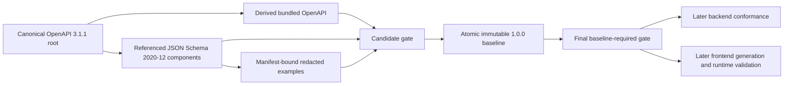

# Implementation Plan: Anonymous Battleship API Contract

**Branch**: `feature/001-api-contract` | **Date**: 2026-08-20 | **Spec**: [spec.md](spec.md)

**Input**: Clarified feature specification from `specs/001-api-contract/spec.md`, governed by
`.specify/memory/constitution.md` and cross-checked against `docs/rewrite_context_doc/`.

## Summary

Create the independent `contracts/` product that is the only source of truth for the anonymous
Battleship v1 wire boundary. The product will use an OpenAPI 3.1.1 root document that references
JSON Schema 2020-12 components, plus redacted examples, API and SSE guides, a compatibility policy,
a changelog, an immutable release baseline, and deterministic Node-based validation. It will define
exactly the 11 accepted operations, full caller-safe snapshots, dual revision semantics, anonymous
cookie security, explicit invitation redemption, versioned commands and leave, terminal statistics,
snapshot-based SSE recovery, lifecycle behavior, problem details, and health without adding backend
controllers, frontend code, rule-engine implementation, persistent state, or deployment automation.

## Technical Context

**Language/Version**: OpenAPI 3.1.1; JSON Schema draft 2020-12; YAML 1.2/JSON/Markdown contract
artifacts; Node.js 24.19.0 LTS with ESM JavaScript for validation; TypeScript 6.0.3 only for a
temporary generated-consumer smoke compile.

**Primary Dependencies**: npm with exact versions in `package-lock.json`; `@redocly/cli` 2.45.0
for specification lint and bundle; Ajv 8.20.0 for schema/example validation; `openapi-typescript`
7.13.0 for temporary type generation; TypeScript 6.0.3 for `tsc --noEmit`. Redocly telemetry is
disabled with `telemetry: off`; every Redocly call uses a local Node wrapper that also sets
`REDOCLY_TELEMETRY=off` and `REDOCLY_SUPPRESS_UPDATE_NOTICE=true`. Product-local `.npmrc` disables
audit, funding, and update-notifier output. Validation uses only pinned local binaries, local schemas,
and local `$ref` targets; no `npx`, global tool, remote executable schema input, or remote `$ref`
target is allowed. Required dialect/schema identifier URIs and documentation links remain allowed. No Java
dependency, second contract framework, generated client package, or application runtime belongs to
this feature.

**Storage**: Version-controlled files only. `dist/`, temporary generated types, and validation
scratch data are reproducible and ignored. No database, cache, broker, durable game state, or
runtime configuration.

**Testing**: Redocly lint/bundle; Ajv validation of every committed JSON example; Node built-in test
runner for contract invariants, operation matrices, SSE framing, compatibility classifications,
privacy/redaction, and terminal arithmetic; temporary `openapi-typescript` generation followed by
`tsc --noEmit` from both backend-neutral and web-consumer fixtures.

**Target Platform**: Language-neutral HTTP/SSE consumers. Contract development and validation run
locally on any Node 24.19.0/npm environment supported by the selected tools.

**Project Type**: Independently buildable API-contract artifact product.

**Performance Goals**: No server throughput goal applies. The gate must validate all published
operations, references, examples, scenarios, and compatibility fixtures deterministically without
network access after `npm ci`; generated and attacker-controlled fixture processing must be bounded.

**Constraints**: One canonical wire source; exact v1 route surface; request objects closed to unknown
fields; response/event objects evolution-tolerant; no reusable secrets or hidden boards in committed
artifacts; no localized problem prose; no backend/frontend source; no generated output edited by hand;
no CI, deployment, hosting, database, durable replay, or cross-restart recovery.

**Scale/Scope**: 11 method/path combinations, 65 functional requirements, 9 success criteria, 2
immutable rulesets, 7 game commands, 2 revision concepts, 19 stable problem codes, 18 documented
HTTP success/failure statuses, 5 user journeys, and all listed race/recovery/privacy/lifecycle edges.

### Exact feature-local commands

| Purpose | Command from repository root | Acceptance |
|---|---|---|
| Install | `cd contracts && npm ci` | Exact lockfile installs without changing it. |
| Lint | `cd contracts && npm run lint` | Canonical source and all references pass the configured OpenAPI rules. |
| Build | `cd contracts && npm run build` | A single derived `dist/openapi.json` bundle is produced from the canonical root. |
| Test | `cd contracts && npm test` | Node contract, scenario, privacy, compatibility, and invariant tests pass. |
| Validate | `cd contracts && npm run validate` | Every manifest entry, example, SSE fixture, and redaction rule passes. |
| Consumer smoke | `cd contracts && npm run smoke:typescript` | Temporary generated types compile and are removed; no consumer source is committed. |
| Candidate gate | `cd contracts && npm run check:candidate` | All local checks pass before the initial release baseline exists; any existing baseline is still validated and scanned. |
| Create release baseline | `cd contracts && npm run baseline:create` | The candidate gate passes, then the generated bundle is atomically archived without overwriting an existing baseline. |
| Local run-equivalent | `cd contracts && npm run check` | Lint, build, release-baseline-required validation, tests, and smoke compile pass. |
| Completion gate | `cd contracts && npm ci && npm run check` | Fresh installation plus the complete post-baseline feature gate is green. |

The package scripts are normative orchestration, not aliases left to implementation judgment:

- `lint`: `node validation/run-redocly.mjs lint openapi/openapi.yaml --config redocly.yaml`;
- `build`: `node validation/run-redocly.mjs bundle openapi/openapi.yaml --config redocly.yaml --output dist/openapi.json --ext json --component-renaming-conflicts-severity=error`;
- `validate`: `node validation/validate.mjs`; the not-yet-created initial baseline may be absent, but
  any present baseline is validated and scanned;
- `validate:release`: `node validation/validate.mjs --require-release-baseline`; the release baseline
  is mandatory and missing or drifted content fails;
- `test`: `node --test validation/tests`;
- `smoke:typescript`: `node validation/smoke-types.mjs`;
- `check:candidate`: run `lint`, `build`, `validate`, `test`, then `smoke:typescript` in that order and
  stop on the first failure;
- `baseline:create`: `node validation/create-baseline.mjs`; internally run `check:candidate`, refuse
  overwrite, and atomically archive the passing `dist/openapi.json`;
- `check`: run `lint`, `build`, `validate:release`, `test`, then `smoke:typescript` in that order and
  stop on the first failure.

In the completed product workflow, `npm ci` is the only network-bearing command. The one-time
implementation step that creates `package-lock.json` runs only after `.npmrc` controls exist and is
not a published validation gate. Every npm script above is local-only after install.

The contracts product has no HTTP runtime. Redocly CLI v2 removed its former standalone
`preview-docs` flow in favor of a separate documentation product, so adding a preview server would
expand this feature. Human review uses the bundled OpenAPI plus the committed guides and examples.

## Constitution Check

*GATE: Passed before Phase 0 research; re-checked after Phase 1 design below.*

| Principle | Pre-design result | Plan response |
|---|---|---|
| I. Contract Before Implementation | PASS | Only `contracts/` wire artifacts are planned; later products consume rather than redefine them. |
| II. Server Authority and Player Privacy | PASS | Schemas publish intent and caller-safe projections, never client authority or hidden state. |
| III. Simple, Replaceable Boundaries | PASS | One Node contract product, one canonical OpenAPI root, referenced schemas, and focused validation modules. |
| IV. Practical Proof of Behavior | PASS | Each story, risk, and success criterion maps to a fixture or deterministic validator. |
| V. Accessible, Secure, Observable Operation | PASS | Stable language-neutral codes, exact security headers/cookies, safe health, and redaction are contract obligations. |
| VI. Independent Artifacts and Current Evidence | PASS | Source, derived bundle, release baseline, examples, guides, and evidence have explicit ownership. |
| VII. Local Production-Like Readiness | PASS | Exact install/lint/build/test/validate/smoke/check commands are feature-local and runtime-free. |
| VIII. Proportionate Process | PASS | No second framework, code generator output package, CI, deployment, or application layer is introduced. |

No constitutional exception or complexity waiver is required.

## Phase 0 Research Conclusions

Detailed Decision/Rationale/Alternatives records are in [research.md](research.md). The decisions
that control Phase 1 are:

1. OpenAPI 3.1.1 and JSON Schema 2020-12 remain the pinned contract dialects even if a newer OpenAPI
   release exists; this matches the accepted feature baseline and selected tool compatibility.
2. `openapi/openapi.yaml` is the only canonical HTTP source. Reusable JSON schemas are referenced,
   not copied. Bundles, release baselines, and generated types are derived artifacts.
3. Timestamps are UTC RFC 3339 strings with exactly millisecond precision; wire integers never exceed
   JavaScript's safe-integer maximum; coordinates use zero-based `rowIndex`/`columnIndex`; accuracy is
   a 0..1 number rounded half-up to four fractional digits.
4. Snapshot and game-state validators are distinct opaque strong entity tags. Clients echo them but
   never construct or parse them.
5. The problem catalogue is closed for v1 and uses stable `urn:battleship:problem:<code>` types,
   language-neutral codes, structured violation/recovery fields, and no `title` or `detail`.
6. The active spec supersedes historical context wherever it differs: SSE IDs and replay ordering use
   `snapshotRevision`; eligible presence publishes a newer snapshot without changing `gameVersion`;
   active-play leave returns `409 resign-required` and requires explicit `RESIGN`; the invitation is
   fragment-only with no token-copy flow; starting seat is selected at creation and concealed; and
   `/presence` remains part of the exact 11-operation surface.

## Architecture and Ownership



- `contracts/` owns public paths, schemas, headers, cookies, status semantics, SSE framing, examples,
  compatibility, release baseline, and validation.
- `specs/001-api-contract/contracts/` contains Phase 1 design inventories only. It is not a second
  machine-readable contract and cannot be consumed in place of the root product.
- Backend, frontend, and root integration work are downstream features. They must not be created or
  edited by this feature.
- The HTML mockup is used to prove the wire model can feed all nine UX surfaces; its token controls,
  hard-coded statistics, local game simulation, and other demo values are not API authority.

## Project Structure

### Documentation (this feature)

```text
specs/001-api-contract/
├── spec.md
├── plan.md
├── research.md
├── data-model.md
├── quickstart.md
├── checklists/
│   ├── requirements.md
│   └── task-traceability.md
├── contracts/
│   ├── README.md
│   ├── openapi-design.md
│   ├── operation-matrix.md
│   ├── schema-catalog.md
│   ├── problem-catalog.md
│   └── validation-matrix.md
└── tasks.md                       # generated Phase 2 implementation ledger
```

### Source Code (repository root)

```text
contracts/
├── package.json
├── package-lock.json
├── .npmrc
├── .gitignore
├── README.md
├── redocly.yaml
├── openapi/
│   ├── openapi.yaml               # sole canonical HTTP root
│   ├── paths/                     # exact 11 method/path definitions
│   └── components/                # headers, parameters, responses, security schemes
├── schemas/
│   ├── common.schema.json
│   ├── meta.schema.json
│   ├── ruleset.schema.json
│   ├── invitation.schema.json
│   ├── snapshot.schema.json
│   ├── command.schema.json
│   ├── terminal-statistics.schema.json
│   ├── problem.schema.json
│   └── health.schema.json
├── examples/
│   ├── manifest.json
│   ├── success/
│   ├── problems/
│   ├── sse/
│   ├── privacy/
│   └── compatibility/
├── guides/
│   ├── api-guide.md
│   └── sse-protocol.md
├── baselines/
│   ├── README.md
│   └── 1.0.0/openapi.json         # generated release snapshot; not self-comparison evidence
├── compatibility-policy.md
├── changelog.md
└── validation/
    ├── validate.mjs               # one public validation entry point
    ├── operation-expectations.json # structured method/status/header/security test oracle
    ├── run-redocly.mjs            # local CLI wrapper; disables telemetry/update notices
    ├── create-baseline.mjs        # candidate-gated, atomic, overwrite-refusing release archive
    ├── smoke-types.mjs
    ├── fixtures/                  # committed backend-neutral/web consumer smoke inputs
    ├── lib/                       # focused schema, scenario, privacy, SSE, and diff helpers
    └── tests/                     # Node behavior tests
```

Repository integration files within this feature's documentation and workflow scope:

```text
README.md                         # current rewrite/product index; no duplicated wire definitions
AGENTS.md                         # durable contract-product commands and ownership boundaries
.specify/.gitignore               # per-checkout Spec Kit/bridge runtime state
specs/001-api-contract/           # current plan, task, quickstart, checklist, and evidence artifacts
```

`node_modules/`, `dist/`, `.tmp/`, temporary generated sources, and per-checkout bridge state are
ignored. The committed `baselines/1.0.0/openapi.json` is created only through `baseline:create` after
`check:candidate` passes; creation refuses overwrite and writes atomically. Final `check` requires the
baseline. It establishes the immutable comparison input for later releases but is not compared with
its own source as proof for 1.0.0.

**Structure Decision**: Use a split canonical OpenAPI tree whose `$ref` targets the reusable JSON
Schema files. This keeps each schema authoritative once while allowing Redocly to produce one
language-neutral distribution bundle. Keep validation behind one `validate.mjs` entry point with
small internal modules so each proof remains independently understandable.

## Wire-Design Commitments

The complete design inventories live under this feature's `contracts/` directory:

- [openapi-design.md](contracts/openapi-design.md) defines single-source ownership, exact encodings,
  security/CORS/cache conventions, conditional requests, SSE framing, and compatibility mechanics.
- [operation-matrix.md](contracts/operation-matrix.md) assigns success bodies, headers, cookies,
  authentication, CSRF, cache policy, statuses, and problem outcomes to all 11 operations.
- [schema-catalog.md](contracts/schema-catalog.md) defines every reusable model, discriminator,
  conditional field, validation rule, projection boundary, and terminal arithmetic rule.
- [problem-catalog.md](contracts/problem-catalog.md) fixes the complete v1 problem code/status/recovery
  catalogue and uniform invitation behavior.
- [validation-matrix.md](contracts/validation-matrix.md) maps every story, requirement group, success
  criterion, edge class, scope boundary, assumption, constitution principle, and CHK001–CHK040 concern
  to a planned root artifact, work package, and proof.

## Dependency-Ordered Work Packages for Task Generation

These are planning units, not checked implementation tasks. `$speckit-tasks` must turn them into
small path-owned tasks with `Covers` and `Prove with` evidence.

| Work package | Depends on | Deliverable and review boundary |
|---|---|---|
| WP01 Product skeleton and canonical root | — | npm/lockfile/config, product and bridge ignore rules, local-only Redocly wrapper controls, OpenAPI metadata/version, README ownership rules. |
| WP02 Common vocabulary and problems | WP01 | Identifier/time/tag/coordinate primitives, RFC 9457 schema, stable codes, response/header components. |
| WP03 Metadata, rulesets, and names | WP02 | Meta/ruleset/name schemas, both immutable rule fixtures, public discovery operations. |
| WP04 Identity, invitations, and request security | WP02–WP03 | Cookie/CSRF/CORS components, create/join/rotate operations, fragment guide, uniform redemption failures. |
| WP05 Snapshots, projections, and revisions | WP02–WP04 | Snapshot schemas, boards/ships/allowed actions/deadlines, dual tags, caller privacy fixtures. |
| WP06 Commands, gameplay, leave, and statistics | WP03–WP05 | Seven command variants, leave envelope, processing order, phase results, terminal outcome/statistics fixtures. Gameplay/snapshot foundations are the dependency exported to WP07; only terminal/leave failing tests may overlap WP07, while terminal/leave implementation follows WP07. |
| WP07 Realtime, lifecycle, admission, and health | WP05 plus WP06 gameplay/snapshot foundations | SSE guide/fixtures, presence, expiry/restart, rate/capacity problems, health operation. Serialize the shared invitation schema as base response shapes, then presence, then leave; presence does not wait for terminal/leave failing tests, and terminal/leave implementation follows the WP07 checkpoint. |
| WP08 Examples, compatibility, and release records | WP03–WP07 | Complete example manifest, compatibility policy/fixtures, changelog, candidate/final gate semantics, and initial immutable baseline path. |
| WP09 Deterministic validation and consumer smoke | WP01–WP08 | Lint/bundle, Ajv manifests, operation/status checks, privacy/redaction, SSE, arithmetic, compatibility, temporary TS compile. |
| WP10 Documentation and full contract review | WP09 | API guide, contract and root READMEs, AGENTS/mirror synchronization, current quickstart/task evidence, all-matrix review, and fresh `npm ci && npm run check` evidence. |

Shared canonical files are serial dependencies. Tasks must not claim parallel edits to
`openapi/openapi.yaml`, `examples/manifest.json`, `compatibility-policy.md`, or the validation
orchestrator without an explicit merge owner.

## Scenario and Proof Strategy

| Evidence class | Planned proof |
|---|---|
| Canonicality and route surface | Assert exactly the 11 accepted operations, no aliases, no unresolved `$ref`, and one definition per published wire element. |
| Examples and schemas | Manifest requires every published request, response, snapshot, ruleset, problem, health body, and SSE data payload to validate against the referenced schema. |
| Two complete journeys | Contract-only sequences cover create-to-terminal play for both rulesets, including waiting, placement, ready, fire, result, and leave. |
| Security and invitations | Header/cookie matrix plus redaction scans prove no capability, cookie value, reusable secret, full secret-bearing URL, or existence oracle is committed. |
| Projection privacy | Owner/guest fixtures and paired hidden-board variants prove equivalent caller-visible output until allowed terminal disclosure. |
| Dual revisions and recovery | Transition table proves both revisions advance once for game transitions, only `snapshotRevision` advances for eligible presence, and reads/failures/reconnects do not advance. |
| Retry and concurrency | Fixtures cover identical duplicate, changed command ID content, missing/stale preconditions, repeated target, racing transitions, and uncertain create/join/rotation. |
| SSE | Raw text fixtures prove one `snapshot` event, decimal `snapshotRevision` ID, direct full-snapshot JSON data, replay fallback, and post-commit close semantics. |
| Lifecycle and admission | Boundary fixtures cover idle/absolute/invitation/terminal deadlines, rate versus adjustable admission, 429/503 retry guidance, restart epoch, 410/404 distinction. |
| Terminal statistics | Schema and arithmetic tests cover null/zero samples, half-up accuracy, turn/shot timing, match-duration partition, fleet totals, and identical seat-keyed facts. |
| Independent consumers | Temporary generated types compile under TypeScript without importing backend/frontend source; a second fixture checks response-forward compatibility. |
| Compatibility | Synthetic additive/breaking pairs prove policy classification; 1.0.0 is archived but never self-compared as release evidence. |

## Coverage for the Next Phase

The plan does not create `tasks.md`. [validation-matrix.md](contracts/validation-matrix.md) provides the
complete provisional mapping that `$speckit-tasks` must preserve. After task generation, the reviewer
must confirm every functional-requirement range, success criterion, story/scenario, edge, scope item,
assumption, and applicable constitution principle has at least one task, named path, and proving
command before marking `checklists/task-traceability.md` complete.

## Post-Design Constitution Re-check

| Gate | Result | Phase 1 evidence |
|---|---|---|
| Contract is the only cross-product authority | PASS | Root source layout and OpenAPI design prohibit consumer redefinition and machine-readable duplicates. |
| Server authority and caller privacy remain explicit | PASS | Data model, schema catalogue, problem catalogue, and privacy fixtures contain no client authority or hidden-state inference. |
| Boundaries stay simple and replaceable | PASS | One contract product and one validation entry point; no application framework or second protocol description. |
| Observable behavior has proportionate proof | PASS | Validation matrix covers all stories, requirements, success criteria, and high-risk edges without coverage quotas. |
| Security, accessibility/localization boundary, and safe operation are represented | PASS | Exact cookie/CSRF/CORS/cache/problem/health rules and stable language-neutral identifiers are planned. |
| Artifacts and evidence remain distinct/current | PASS | Canonical source, ignored bundle, committed release baseline, examples, guides, and fresh commands have separate roles. |
| Local production-like verification is exact | PASS | `npm ci && npm run check` is the accepted feature gate; no missing product runtime is called green. |
| Process remains proportionate and worktree-safe | PASS | Phase 1 creates only planning files; task generation and implementation remain separate commands. |

## Complexity Tracking

No constitution violation requires justification. The multi-file source tree is not a second product:
all files are one npm contract artifact, and the root OpenAPI document owns the reference graph.
