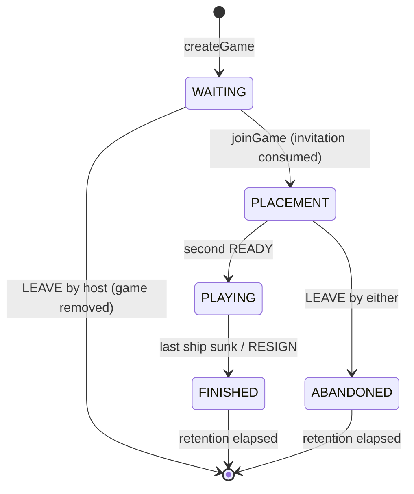

# Data Model: Battleship Backend

**Plan**: [plan.md](plan.md) · **Wire shapes**: [`contracts/openapi.yaml`](../../contracts/openapi.yaml)

Internal model only. Wire schemas are the contract's and are not restated: the DTO records in
`ua.kostenko.battleship.app.web.dto` are **generated** from `contracts/openapi.yaml` into
`app/target/generated-sources/openapi`, are build output rather than committed source, and are never
hand-edited (research.md D1 and D28; Constitution VI). What `application` produces is `SnapshotView`
(§ *Projection view*), the framework-free carrier that `SnapshotDtoAssembler` in `app/web` copies into
the generated `GameSnapshot`.

## Domain (`backend/domain`, no framework)

All types are records and deeply immutable — collections stored with `List.copyOf` / `Map.copyOf`.
`GameRules.apply(GameState, GameCommand, Instant now, RandomSource random)` is the only transition and
returns `Transition`. It reads no clock and creates no randomness of its own.

| Type | Fields |
|---|---|
| `GameState` | `rulesetId`, `Phase phase`, `long version`, `PlayerState host`, `PlayerState guest?`, `Seat turn?`, `Shot lastShot?`, `Outcome outcome?`, `Timeline timeline` |
| `PlayerState` | `displayName`, `boolean ready`, `Board board`, `List<Shot> shotsFired` (shots made **by** this player) |
| `Board` | `List<Ship> fleet` (whole fleet from `PLACEMENT` on, placed or not), `Set<Coordinate> incomingShots` (cells fired at **on** this board), `Set<Coordinate> revealedWater` |
| `Ship` | `shipId` (`s01`…), `shipTypeId`, `int length`, `Coordinate anchor?`, `Orientation orientation?`, `Set<Coordinate> hits` |
| `Coordinate` | `int rowIndex`, `int columnIndex` (zero-based; row 0 top, column 0 left) |
| `Ruleset` | `id`, `int rows`, `int columns`, `List<FleetEntry>`, `boolean shipsMayTouch`, `boolean extraTurnOnHit`, `boolean revealWaterAroundSunk` |
| `Shot` | `Seat by`, `Coordinate target`, `ShotResult result`, `sunkShipId?` (present only when `result` is `SUNK`) |
| `Outcome` | `Seat winner`, `Reason reason` (`FLEET_DESTROYED` \| `RESIGNATION`) |
| `Timeline` | the instants and samples of § *Statistics* |
| `Transition` | `GameState next`, `boolean versionBumped`, `Set<Seat> viewChanged`, `Rejection?` |
| `Rejection` | the `ProblemCode` the refusal maps to and, for a validation failure, the JSON Pointer to the offending field plus the `Violation.rule` value. Present exactly when the command was refused |

`Seat` is `HOST` \| `GUEST` internally and is mapped to the contract's caller-relative `YOU` /
`OPPONENT` only in the projector. `Ship.cells` and `status` are derived, never stored: cells from anchor + orientation + length, status
from `hits` (`INTACT` / `DAMAGED` / `SUNK`). `Player.shipsRemaining` is derived the same way — fleet
size minus sunk ships — in `SnapshotProjector` (R22).

`version` starts at 0 when the game is created, is per game, rises monotonically and is never reset.
A **view** is a player's snapshot excluding `serverTime` and `expiresAt` (spec R18); `viewChanged`
names the seats whose view the transition actually altered.

### Rulesets (R05–R08)

The two ruleset identifiers, boards, fleets and flags are spec R05 — published product data, defined
once there. Immutable constants in `domain/rules`; a correction is published under a new `id` (R03).
Ship ids are assigned in fleet order at fleet creation and never change (R21, D21).

## State machine (R12)

No other transition and no way back. `ABANDONED` is reachable only from `PLACEMENT`: a `WAITING`
game nobody joined is removed outright rather than shown as abandoned (R16). Expiry is a registry
decision, not a phase.

## Allowed actions

Spec R13 is the single authority for what `allowedActions` contains in each situation; it is computed
here per player per moment and never restated.

## Invariants (asserted after every accepted transition)

1. Every ship lies wholly on the board, is straight, and no two ships overlap.
2. Where `shipsMayTouch` is false, no two ships are within Chebyshev distance 1.
3. The fleet multiset equals the ruleset's, placed or not, for the whole game.
4. `hits ⊆ cells` for every ship; `hits` and `incomingShots` only ever grow.
5. In a player's own-board projection every cell carries exactly one `CellState`, and never `UNKNOWN`:
   `SHIP` (a ship cell not yet hit), `HIT` (a ship cell hit while its ship is afloat), `SUNK` (a cell
   of a sunk ship), `MISS` (an incoming shot on an empty cell), `REVEALED_WATER` (an empty cell
   disclosed around a sunk ship), `WATER` (every other empty cell). The six are disjoint and cover the
   board.
6. `turn` is present exactly in `PLAYING`; `outcome` and statistics exactly in `FINISHED`.
7. `version` rises by exactly one when a transition changes at least one player's view, and never
   otherwise — not on a read, not on a refusal, and not on an accepted command that changes no view
   (R15, R18, R23).
8. A refused command returns the input state by identity.
9. `ready` never returns to false; `phase` never moves backwards.
10. A player's own board contains no `UNKNOWN` cell (R20).
11. Two states differing only in the opponent's undiscovered ships project identically for that
    opponent, until `FINISHED` (R19, S2).

## Rule details

- **`PLACE_SHIP`** relocates and rotates atomically. Placing a ship exactly where it is, and removing
  an unplaced ship, both succeed and change nothing. They are accepted commands, so they move the idle
  deadline and their `commandId` is recorded (R23, R24, R42) — but no view changed, so the version does
  not rise and nothing is pushed to either player (R18, R28).
- **Refusal reasons are distinct** (R09): a coordinate outside the board or an unknown `shipId` is
  `422` (`OUT_OF_RANGE`, `UNKNOWN_VALUE`); a ship that would extend past the edge is
  `placement-out-of-bounds`; an overlap is `placement-overlap`; a forbidden touch is
  `placement-touching`.
- **`PLACE_FLEET_RANDOMLY`** draws from `RandomSource`, places longest ships first, and gives up after
  the configured attempt limit — an ordinary refusal that leaves the fleet exactly as it was (R26).
- **`FIRE`** on a cell already disclosed is `target-already-fired`: no turn consumed, nothing changed
  (R10). On a sink under `revealWaterAroundSunk`, every still-`UNKNOWN` neighbour of every cell of
  that ship — up to eight per cell — becomes `REVEALED_WATER` without a shot (R08).
- **Turn**: under `extraTurnOnHit` a hit or sink keeps the turn; otherwise every shot passes it.
- **First turn** (R11): the player whose `readyAt` is earlier; an exact tie is broken by
  `RandomSource`. First visible when play starts.
- **End**: the last ship of a fleet sinking, and the resignation, are each atomic with the move to
  `FINISHED` — no observable "sunk but still playing" state.

## Statistics (R51) — sampling boundaries

Recorded in `Timeline` from accepted transitions and `TimeSource` only. Absent entirely for
`ABANDONED`.

| Instant | Set when |
|---|---|
| `guestJoinedAt` | the join is accepted (start of the match clock) |
| `readyAt[seat]` | that seat's `READY` is accepted |
| `playStartedAt` | the second `READY` is accepted |
| `finishedAt` | the sinking or resignation that ends the game |

| Field | Boundary |
|---|---|
| `match.totalDurationMs` | `guestJoinedAt → finishedAt` |
| `match.placementDurationMs` | `guestJoinedAt → playStartedAt` |
| `match.gameplayDurationMs` | `playStartedAt → finishedAt` |
| `you/opponent.placementDurationMs` | `guestJoinedAt → readyAt[seat]` |
| `shots` | accepted `FIRE` commands by that seat |
| `hits` | those whose result was `HIT` or `SUNK` |
| `accuracy` | `hits / shots`, 4 decimals; absent when `shots` is 0 |
| `turns` | one sample per turn: from gaining the right to fire until it passes or the game ends. `turnStartedAt` is set to `playStartedAt`, then to the instant of each pass; the holder's open turn is closed at `finishedAt` |
| `shotDecisions` | one sample per accepted `FIRE`: from being able to fire until the shot. Reset at every `turnStartedAt` **and** after each accepted `FIRE` that retains the turn. A refused `FIRE` does not reset it |
| `fleet` | that seat's own fleet at `finishedAt`: `intact` = no hits, `damaged` = some hits not sunk, `sunk` = all cells hit |

`averageMs` is `round(totalMs / count)`; `fastestMs`, `slowestMs` and `averageMs` are absent when
`count` is 0. Identities the contract asserts and the proofs must show:
`total = placement + gameplay`; `you.turns.totalMs + opponent.turns.totalMs = match.gameplayDurationMs`;
`shotDecisions.count = shots`; `intact + damaged + sunk = total`.

## Projection view (`backend/application/projection`, no framework)

`SnapshotProjector` returns these records rather than a wire type: `application` may contain no framework
type and the generated DTOs carry Jackson annotations (research.md D31). They are deeply immutable, take
no decision of their own, and never leave the server — `SnapshotDtoAssembler` in `app/web` copies them
field for field into the generated DTOs (plan.md § *Projection*), and that one document is what goes on
the wire for HTTP and SSE alike (R17).

Their fields are those of the contract schema each is copied into, so they are not restated here. The
mapping is 1:1 and total:

| `application` record | Generated DTO it is copied into |
|---|---|
| `SnapshotView` | `GameSnapshot` |
| `BoardView` | `Board` |
| `PlayerView` | `Player` |
| `ShotView` | `Shot` |
| `StatisticsView` | `GameStatistics`, and with it `MatchStatistics`, `PlayerStatistics`, `DurationAggregate`, `FleetSummary` |

Two things the view deliberately does not mirror. `Seat` is already resolved to the contract's
caller-relative `Side` (`YOU` / `OPPONENT`) by the projector, so no view record carries `HOST`/`GUEST`.
And `serverTime` and `expiresAt` ride on `SnapshotView` but are not part of a **view** in the R18 sense:
they are always current, which is exactly why they are excluded from what moves `version`.

## Registry state (outside the aggregate)

| Type | Module | Fields |
|---|---|---|
| `Slot` | `application/port` | The port-facing view of one game's mutable state, and the only shape an `application` use case sees. Reads and replaces the aggregate — `GameState state()`, `replace(GameState next)`; the idempotency memory — `Set<UUID> acceptedCommandIds()`; the four deadlines — `idleDeadline()`, `absoluteDeadline()`, `invitationDeadline()`, `terminalRetentionDeadline?()` — and `Map<Seat, Instant> presenceNotBefore()`; the digests and the one plaintext secret — `hostSessionDigest()`, `guestSessionDigest?()`, `invitationDigest?()`, `unusedInvitationSecret?()`, with the setters the use cases of T018–T021 need; and **`SnapshotContext contextFor(Seat seat, Instant now)`** |
| `GameSlot` | `app/registry` | Implements `Slot`. `ReentrantLock`, `GameState`, `hostSessionDigest`, `guestSessionDigest?`, `invitationDigest?`, `unusedInvitationSecret?`, `Set<UUID> acceptedCommandIds`, `idleDeadline`, `absoluteDeadline`, `invitationDeadline`, `Map<Seat, Instant> presenceNotBefore`, `Map<Seat, Subscriber>`, `terminalRetentionDeadline?` |
| `SessionRecord` | `app/registry` | `digest`, `createdAt`, `lastSeenAt` (drop-least-recently-used under the cap, R41), `Set<GameId> liveGames` (per-browser cap, R62) |
| `Subscriber` | `app/realtime` | `SseEmitter`, `Seat`, `openedAt` (enforces `stream-max-lifetime-seconds`, R30), latest unsent snapshot (single slot, coalescing). It is an SSE type, so it lives beside the hub that owns it; `GameSlot` holds the `Map<Seat, Subscriber>` |

`Slot` is what `GameSlotStore.withSlot(GameId, Function<Slot, T>)` (plan.md § *Ports*) hands the
function it runs under the lock. It exists so that `CommandUseCase` and the other `application` use
cases never name `GameSlot`, which lives in `app` — the module direction of plan.md § *Layout*.
`contextFor` is the same rule applied to research.md D27: the projector's `SnapshotContext` is built
from data that lives on the slot, so the slot builds it. `app/registry.SnapshotContextFactory` is
`GameSlot`'s implementation of that one method; the projector still never sees `GameSlot`.

Both `GameState` and `SnapshotContext` are immutable records, so a use case captures the pair inside
`withSlot` and projects **after** the lock is released — which is what keeps plan.md § *Command path*'s
"no projection while the lock is held" true.

`terminalRetentionDeadline` is set from the instant the game finished, was abandoned or expired,
whichever happened (R44, R63). `unusedInvitationSecret` is the only plaintext secret held, permitted
by Constitution II so the host's `WAITING` snapshot can carry `invitationUrl`; it is dropped the
instant the invitation is used, replaced or expires. Session values are never stored — only their
SHA-256 digest (R32).
